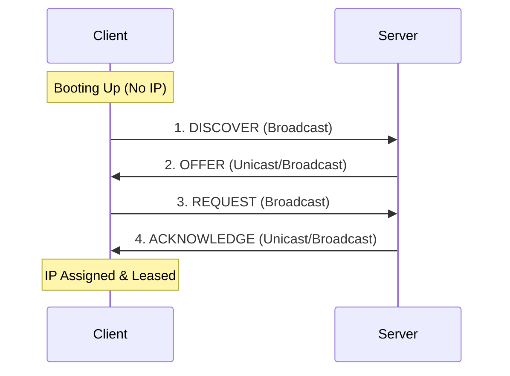

#domain/3-0-Network-Operations

When a client connects to a network, it goes through a four-step process to obtain an IP address:

 ==**Discover (D)**:== The client broadcasts a message (`255.255.255.255`) searching for available DHCP servers on the local subnet.
   - **Source IP**: `0.0.0.0`
   - **Destination IP**: `255.255.255.255`
   
==**Offer (O)**:== Any DHCP server that receives the Discover message responds with an available IP address, subnet mask, lease duration, and the server's own IP address.
   - **Source IP**: DHCP Server IP
   - **Destination IP**: Broadcast (`255.255.255.255`) or unicast to client MAC address.
   
==**Request (R)**==: The client broadcasts a request message to accept the offered IP address. Broadcasting this allows other DHCP servers that may have sent offers to release their reserved IPs back to their pools.
   - **Source IP**: `0.0.0.0`
   - **Destination IP**: `255.255.255.255`

==**Acknowledge (A / DHCP ACK)**:== The server confirms the IP lease, sending the final network configuration parameters (default gateway, DNS servers, etc.) to the client.
   - **Source IP**: DHCP Server IP
   - **Destination IP**: Broadcast or unicast.

### **DHCP Lease Renewal (T1 & T2)**
- **T1 (Renewal Timer)**: At **50%** of the lease time, the client attempts to renew its lease. It sends a **unicast** DHCP Request directly to the original leasing server.
- **T2 (Rebinding Timer)**: At **87.5% (7/8ths)** of the lease time, if the original server hasn't responded, the client broadcasts a DHCP Request to *any* available DHCP server on the network.
