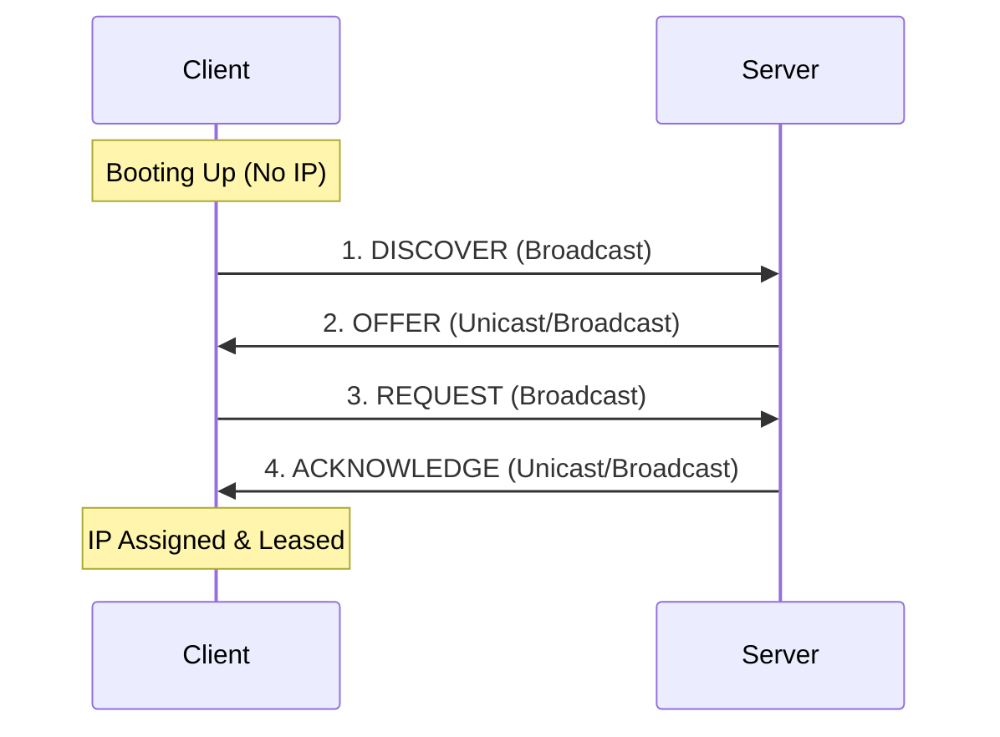

# Network+ Concepts - Complete Study Notes

This file contains all 417 Network+ study concepts compiled from the Concepts directory for NotebookLM flashcard generation and study.

---


# 802.11

#domain/2-0-Network-Implementation
#objective/2-3-Wireless

*Wi-Fi 6E added 6 GHz*

| Standard | Freq        | Max Speed | Range  | Key Feature              | Gen |
| -------- | ----------- | --------- | ------ | ------------------------ | --- |
| 802.11a  | 5 GHz       | 54 Mbps   | Short  | First 5 GHz              |     |
| 802.11b  | 2.4 GHz     | 11 Mbps   | Long   | Legacy                   |     |
| 802.11g  | 2.4 GHz     | 54 Mbps   | Long   | b compatible             |     |
| 802.11n  | 2.4/5 GHz   | 600 Mbps  | Medium | MIMO, bonding            | 4   |
| 802.11ac | 5 GHz       | 6.9 Gbps  | Medium | [[MU-MIMO]], 160 MHz     | 5   |
| 802.11ax | 2.4/5/6 GHz | 9.6 Gbps  | Medium | [[OFDMA]], efficiency    | 6   |
| 802.11   | 2.4 GHz     | 2 Mbps    | Long   |                          |     |
| 802.11ad | 60 GHz      | 7 Gbps    | 10m    | High-speed, depends room |     |
| 802.11be | 2.4/5/6 GHz | 46 Gbps   | 60m    |                          | 7   |

**==2.4 GHz==**
Longer range, less non-overlapping channels and more interference with device congestion

**==5 GHz==**
More non-overlapping channels and wider channels (20/40/80/160 MHz)
Wider channels increases speed but lowers reuse and may cause interference with other AP's

[[CSMA-CA]]

**==802.11h==**
*Spectrum and power management in wireless networks*
- **Transmit Power Control (TPC)** — dynamically reduces AP transmit power to minimise interference with other devices/networks
- **Dynamic Frequency Selection (DFS)** — allows APs to automatically switch channels to avoid interference with radar systems (mandatory in the 5 GHz band in many regions)

**==802.11k==**
AP gives the client a list of nearby APs

**==802.11s==**
Makes a normal AP into a mesh points

**==802.11v==**
Helps steer clients to better APs, network suggests better APs

==**802.11r (Fast BSS Transition FT)**== 
Improves roaming speed by speeding up key exchange between access points. Pre-authenticates the client with nearby APs before roaming occurs. 


***Transmission types:***
*DSSS:* Direct Sequence Spread Spectrum, spreads data across wide frequency range by mixing it with a special code, used in 802.11b, 802.11

*FHSS:* Frequency Hopping Spread Spectrum, signal rapidly hops between different frequencies, used in 802.11 to avoid interference. Used in original 802.11. 

*SU-MIMO:* Multiple spatial streams (Multiple input, multiple out), [[AP]] talks to 1 client at a time with multiple spatial streams

*MU-MIMO:* Multiuser, AP talks to multiple client at the same time. 

*Beamforming:* Focus Wi-FI signal towards a client instead of broadcasting it.

*OFDM:* Splits a wireless channel into many smaller sub-channels, one device takes in all the channel

*OFDMA:* Orthogonal Frequency Division Multiple Access, an upgrade to OFDM, the split channel is shared among devices

Wi-Fi 6E/7 (also 6 GHz) requires WPA3 for security / modern protections.


In 2.4GHz band on non-overlapping channels are 1, 6 and 11, better range however more congestion 

Dense environment with interference between APs → the answer usually involves **narrower channels** or **5 GHz**. If it asks about maximising throughput for a single client → **wider channels**.

Have 30 to 50 clients on one AP.

**==Band Steering==**
Directs dual-band clients to the less congested band (typically 5 GHz) for better performance

---

# 802.1p

#domain/1-0-Networking-Concepts
#objective/1-2-QoS

Standard for implementing Quality of Service ([[QoS]]) in networks.

---

# 802.1Q

#domain/2-0-Network-Implementation
#objective/2-2-Switching

Networking standard that supports [[VLAN]]s on an Ethernet network

---

# 802.1w

#domain/2-0-Network-Implementation
#objective/2-2-Switching

[[RTSP]]

---

# 802.1X

#domain/4-0-Network-Security
#objective/4-3-Network-access-control

Network access control [[NAC]] for authentication
Not port number (443) but physical port security 

*802.1X with [[EAP]] (Extensible Authentication Protocol)*
Authenticate devices through a [[RADIUS]] server

|Role|Device in diagram|Function|
|---|---|---|
|Supplicant|Tablet, Laptop|Client requesting network access|
|Authenticator|AP, Switch|Gatekeeper — blocks traffic until authenticated, relays EAP frames between supplicant and auth server|
|Authentication server|RADIUS server|Verifies credentials, tells authenticator to open the port|

---

# 802.3

#domain/1-0-Networking-Concepts
#objective/1-5-Transmission-media

**Wired Ethernet** 

| Name              | Speed      | Cable type                                   | Max length    | Connector   | Notes                                        |
| ----------------- | ---------- | -------------------------------------------- | ------------- | ----------- | -------------------------------------------- |
| **10BASE-T**      | 10 Mb/s    | UTP Cat 3+ (2 pair)                          | 100 m         | RJ-45       | Legacy; half-duplex possible but disable it. |
| **100BASE-TX**    | 100 Mb/s   | UTP Cat 5 (2 pair)                           | 100 m         | RJ-45       | Fast Ethernet; 100 MHz; full-duplex default. |
| **1000BASE-T**    | 1 Gb/s     | UTP Cat 5e(4 pair ALL used)                  | 100 m         | RJ-45       | Gigabit; auto-MDIX fixes straight/cross.     |
| **10GBASE-T**     | 10 Gb/s    | UTP Cat 6a/Cat 7 802.3an                     | 100 m         | RJ-45       | 10 Gig; watch cable bend radius.             |
| **1000BASE-SX**   | 1 Gb/s     | Multi-mode fiber (MMF) 62.5/125 or 50/125 µm | 220 m – 550 m | [[LC]]/SC   | cheap, short-reach inside building.          |
| **1000BASE-LX**   | 1 Gb/s     | Single-mode fiber (SMF) 9/125 µm             | 5 km          | LC/[[SC]]   | campus & MAN links.                          |
| **10GBASE-SR**    | 10 Gb/s    | MMF OM3/OM4                                  | 26 m – 400 m  | LC          | “SR” = Short Reach.                          |
| **10GBASE-LR**    | 10 Gb/s    | SMF                                          | 10 km         | LC          | “LR” = Long Reach.                           |
| **10GBASE-ER**    | 10 Gb/s    | SMF                                          | 40 km         | LC          | “ER” = Extended Reach.                       |
| **40GBASE-SR4**   | 40 Gb/s    | MMF OM4 parallel (8 fiber, 4-lane)           | 100 m         | [[MPO]]/MTP | Data-center spine.                           |
| **100GBASE-SR10** | 100 Gb/s   | MMF OM4 parallel (20 fiber)                  | 100 m         | MPO/MTP     | Same idea, more lanes.                       |
|                   | 10 Gb/s    | UTP Cat6                                     | 55 m          |             |                                              |
|                   | 25/40 Gb/s | Cat 9                                        | 30 m          |             |                                              |

- [[MMF]] 
- [[SMF]] 
- [[POE]]

Base for baseband - entire medium used for 1 channel 
Broad for broadband - bandwidth split into multiple channels

T - Twisted Pair 
CX - Short Range copper example twinaxial (older) ethernet 
CR - Copper direct attach (DAC), twinaxial (newer), short range high speed 
Fibre - SR / LR (Short Range + Long Range)


**STP (Shielded Twisted Pair)**
Consists of four pairs of insulated copper wires twisted around each other. However, STP adds an internal **foil shield or braided mesh barrier** wrapper around either the individual wire pairs, the outer bundle, or both.

**100 Mbp Ethernet** 
Pins 1 & 2 TX
Pins 3 & 6 RX
Pins 4 & 5 POE

**Gigabit Ethernet**
All pins used for data and ethernet 

| Cable Type      | Shielding        | Common Use                | Notes                           |
| --------------- | ---------------- | ------------------------- | ------------------------------- |
| Cat5e (UTP)     | None             | Gigabit Ethernet          | Minimum for modern networks     |
| Cat6 (UTP)      | None             | 10G short runs            | Better crosstalk than Cat5e     |
| Cat6a (UTP/STP) | Optional         | 10G full distance         | Augmented – recommended for 10G |
| Cat7 / Cat7a    | Shielded (S/FTP) | High-performance / future | 10G 100m                        |
| Cat8            | Shielded         | Data centers              | 25/40G 30m                      |
| Coaxial (RG-6)  | Shielded         | Broadband internet        | Rarely for LAN Ethernet         |
| Twinax / DAC    | Built-in         | Switch-to-switch/server   | Direct Attach Copper            |

---

# A

#domain/1-0-Networking-Concepts

Maps hostname to IP address for [[IPv4]]
32-bit IP address
Can be a fall back if [[MX]] is not available 

- If A record updated and web server is unreachable, you can use nslookup to check the hostname and then flush dns 

- A record is what gets cached, so DNS cache poisoning attacks target A records

---

# AAA

#domain/1-0-Networking-Concepts

Authentication - who are you?
Authorisation - what are you allowed to do?
Accounting - what did you do?

Framework for authentication, authorisation & accounting.

---

# AAAA

#domain/1-0-Networking-Concepts

Maps hostname to IP address for [[IPv6]] 128 bit address
Can be used for mail transfer if [[MX]] is not available

---

# Access Control

#domain/1-0-Networking-Concepts

**==RBAC (Role-Based Access Control)==** 
Access is based on the user's job role (e.g., "Accountant", "Salesperson").

**==DAC (Discretionary Access Control)==** 
The owner of a resource determines who has access. This is the model used in standard file systems like NTFS (Windows) and ext4 (Linux), where you can right-click a file and set permissions.

**==MAC (Mandatory Access Control)==** 
The most restrictive model. Access is determined by a central authority (the operating system) based on security labels. An object has a security level (e.g., "Confidential"), and a user has a clearance level. A user can only access objects at or below their clearance level. Often used in government and military environments.

**==ABAC (Attribute-Based Access Control)==** 
A very flexible model where access is granted based on attributes of the user, the resource, and the environment (e.g., "Allow users from the 'Marketing' department to access the 'Sales-Reports' document between 9 AM and 5 PM from a corporate device.").

---

# Access Gateway

#domain/1-0-Networking-Concepts

- Provides user access to network resources
- Not a hardened administrative intermediary
- Commonly used for end-user remote access
- [[VPN]]
- [[Jump Server]] is hardened vs access gate is not

---

# Access Port VLAN

#domain/1-0-Networking-Concepts

Handles untagged traffic. All frames arriving untagged on this port are assigned to the configured [[VLAN]] internally by the switch.

Example commands :  
`switchport mode access` 
`switchport access vlan 20`

---

# Access switch

#domain/1-0-Networking-Concepts

Connects end devices, enforces port security
Manages physical connections and cabling
Provides direct connectivity to end devices
VLAN membership is typically assigned


**==VLAN assignment==**
Access ports are statically or dynamically assigned to a VLAN. The switch tags frames with an 802.1Q VLAN ID as they enter the network. For exam : _"assigning ports to VLANs"_ or _"end-device VLAN membership"_ → access layer.

==**QoS marking**==
Policy enforcement is at distribution, the _initial classification and marking_ of traffic happens at the access layer. For exam: _"classifying/marking traffic at ingress"_ → access layer.

---

# ACL

#domain/4-0-Network-Security

**Access Control List**

Can be used to block ports 
Extended ACL close to the source and standard ACL's close to the destination 

It is used for permit or deny statements on a router or switch that filters traffic based on IP / Port
Evaluated from top to bottom. The first matching entry is applied, and rest are ignored


(Not needed below)
*Ingress filtering* 
Inspects incoming traffic

*Egress filtering* 
Inspects outgoing traffic (useful for preventing internal compromised machines from attacking others)

---

# Active Network Scan

#domain/3-0-Network-Operations

[[Nmap]]
Vulnerability scanners

Will trigger [[SIEM]] / [[IDS]] alert

---

# ADC

#domain/1-0-Networking-Concepts

**Content Gateway / Application Delivery Controller**

A network appliance (often acting as a Layer 7 proxy or advanced load balancer) that sits between the users and the servers or internet. It manages, filters, and distributes application traffic

The ADC is the device that physically hosts the virtual IP. When a user requests a web page, their traffic hits the VIP on the gateway. The gateway inspects the traffic, applies security/filtering policies, and balances the load across the internal web servers

Used for more inbound traffic
Protects and accelerates **inbound** traffic coming _to_ your hosted web applications.

While [[SWG]] is for outbound 
[[Cloud Gateway]] is for connecting on premises network to a [[VPC]]

---

# Administrative Distance

#domain/2-0-Network-Implementation

Not commonly used for optimal path for traffic
Trust for a routing source, lower is better

---

# AES

#domain/1-0-Networking-Concepts

---

# AH

#domain/4-0-Network-Security

==**Authentication Header**==

Provides data integrity - ensures data wasn't changed in transit
Authentication - verifies the sender's identity
However NO encryption

---

# Airtime

#domain/2-0-Network-Implementation

- Wi-Fi is shared time on the air (“airtime”), not shared bandwidth like a cable.
- **Airtime fairness (ATF)**  tries to prevent slow/weak clients from hogging airtime. Every device gets the exact same amount of time (e.g., 10 milliseconds) to talk, regardless of its speed.
- Wi-Fi is half duplex

**Exam scenario:** “One far-away client slows everyone down” → airtime fairness helps mitigate.

Modern features like [[OFDMA]] and [[MU-MIMO]] directly address airtime limits by letting the AP talk to multiple devices at the exact same time.

To preserve airtime for critical corporate traffic, network administrators will often isolate legacy or slow IoT devices onto their own dedicated 2.4 GHz SSID or separate channel entirely, ensuring they don't consume the premium airtime on high-performance 5 GHz or 6 GHz channels.

---

# Antenna

#domain/2-0-Network-Implementation

Omnidirectional Antenna - 360 degrees and standard 
Yagi / Dish / Parabolic - long range point to point
Dipole - short range


- **Omnidirectional** — radiates in all directions (360°) like a donut around the antenna. Standard coverage antenna, used on typical APs for general area coverage.

- **Dipole** — the classic "rubber ducky" antenna you see sticking up on a home router. It's actually a type of omnidirectional antenna — short range, wide coverage, simple.

- **Yagi** — a directional antenna made of a series of parallel elements (looks like a small TV antenna). Focuses signal in a narrow beam for long-range point-to-point or point-to-multipoint links.

- **Dish/Parabolic** — a curved reflector dish that focuses signal into a very tight, high-gain beam. Used for the longest-range point-to-point links (e.g., connecting two buildings miles apart). Most focused/narrow beam of the group.

---

# AP

#domain/1-0-Networking-Concepts

**==Lightweight AP==**
- LAN Controller
- Multiple AP
- Easily expandable

**==Autonomous AP==**
- Without Controller
- Smaller networks
- Individually managed 


Most Wi-Fi is backward compatible - newer APs can talk to older clients.
But network becomes slower, and support is only based on band.
5GHz only AP cannot join a 2.4GHz AP.

---

# APC

#domain/1-0-Networking-Concepts

==**Angled Physical Contact**==

- The ferrule (the tip of the fiber connector) is at 8-degree angle.
- That angle is reflected light bounces outward into the fibre's cladding 
- Colour coded Green.

The counter part is the [[UPC]]

---

# Area Network

==**PAN (Personal Area Network)**== 
smallest scope, devices near one person, typically Bluetooth (phone ↔ headphones/watch). Matches the "individual... Bluetooth" description.

==**CAN (Campus Area Network)**== 
connects multiple LANs/buildings in one location (e.g., a company campus or university). Matches the "all of a company's buildings in the same location" description.

==**PAN < LAN < CAN < MAN < WAN**==
- PAN — one person, few meters
- LAN — one building
- CAN — multiple buildings, one site/campus
- MAN — one city
- WAN — multiple cities/countries

---

# ARM

#domain/1-0-Networking-Concepts

Automatic Radio Management or [[DFS]]

---

# ARP Spoofing - Poisoning

#domain/4-0-Network-Security

An attacker sends **spoofed** ARP messages onto a LAN. The goal is to **poison** the ARP cache of other devices by associating the attacker's MAC address with the IP address of a legitimate device (like the default gateway). 

This results in a Man-in-the-Middle attack. 

Spoofing and poisoning are the same here.

---

# ARP

#domain/1-0-Networking-Concepts

**Address Resolution Protocol**
Layer 2
Responsible for MAC addressing


| ARP Type               | What it does                                                                                                                                              |
| ---------------------- | --------------------------------------------------------------------------------------------------------------------------------------------------------- |
| **ARP Cache**          | A temporary table in RAM that stores IP-to-MAC mappings to improve performance.                                                                           |
| **Gratuitous ARP**     | An ARP message sent by a device to announce its own IP/MAC mapping to the network, often used to detect IP conflicts or update switches after a failover. |
| **Reverse ARP (RARP)** | Used by diskless workstations to request their own IP address based on their known MAC address (mostly legacy).                                           |
| **Proxy ARP**          | When a router answers an ARP request for an IP address that is not on the local network, acting as a gateway for the requester.                           |

---

# Attacks

#domain/4-0-Network-Security

**==VLAN hopping==**
Access data on another VLAN, typically by manipulating traffic with an unauthorised VLAN ID
Caused by switch spoofing + double tagging
Native VLAN misconfiguration enables double tagging
Change native VLAN to unused VLAN, disable auto-trunking on access ports

**==MAC flooding==**
Overwhelming a switch with a large volume of frames from fake source addresses, leading the switch to broadcast traffic to all ports

**==ARP spoofing==**
Malicious ARP packets to a target device, falsely claiming to be a trusted device by associating their own MAC address with the IP address of the trusted device. 

**==ARP poisoning==** 
Device's ARP cache contains incorrect IP-to-MAC address mappings
After an **ARP cache has been poisoned**, the victim's device sends traffic to the attacker instead of the legitimate device.

==**DNS Spoofing (The Overarching Goal)**== 
The act of masquerading as a legitimate DNS server or forging DNS responses to redirect users to a malicious IP address instead of the real one.

**==DNS Poisoning (A Specific Attack Method)**== 
Injecting fake records directly into a **DNS Resolver's cache** so that _everyone_ using that resolver gets redirected until the cache expires.

**==IP Spoofing==**
An attacker creates IP packets with a forged source IP address. This is often used in DDoS attacks to hide the origin of the attack and make it harder to block.

**==DoS/DDoS==**
An amplification attack is a common DDoS technique where an attacker uses a small request to a public server (like DNS or NTP) that generates a much larger response, directing that response to the victim's IP address.

**==Directly poison DNS on client file system==**
Host file is poisoned, bypass DNS 

**==Teardrop==**
DoS attack using malformed IP fragmentation, under DoS attacks
Mostly historical due to modern OS protections

---

# Attenuation

#domain/5-0-Network-Troubleshooting

- Loss of signal strength over distance
- Normal physical property of transmission media

---

# Authentication

#domain/1-0-Networking-Concepts

EAP-MD5
PEAP
EAP-FAST

*Not needed*

---

# Auto-MDIX

#domain/1-0-Networking-Concepts

**==Automatic Medium-Dependent Interface Crossover==**

Automatically detects and corrects for crossover vs. straight-through mismatches.

---

# AWS Direct Connect

#domain/5-0-Network-Troubleshooting

Private network connection between your on-premises infrastructure and a cloud provider, bypassing the public internet entirely.

This is different from a VPN as it doesn't go over the public internet

Used for high bandwidth, low latency and large data transfers

---

# Backup

#domain/1-0-Networking-Concepts

==Full Backup== 

==Incremental Backup==
Backs up only data that has changed since the last backup (any type).

==Differential Backup==
Backs up all data changed since the last full backup. Faster restore than incremental.

==Mirror Backup==
Creates an exact copy of the source at the time of the backup (deletions on source also delete on mirror).

---

# Band Steering

#domain/1-0-Networking-Concepts

AP feature that detects dual-band capable clients and nudges them onto 5 GHz instead of 2.4 GHz

Best available frequency

---

# Bandwidth Utilisation

#domain/5-0-Network-Troubleshooting

Measured with interface utilisation by polling the SNMP interface counters
[[Netflow Analyser]] can also be used

---

# Baseband

#domain/1-0-Networking-Concepts

Uses all available frequencies on its medium to transmit/receive data

---

# Baseline

#domain/3-0-Network-Operations

[[Golden configuration]]

---

# Beamforming

#domain/1-0-Networking-Concepts

Focuses Wi-Fi the signal toward a specific client device.

---

# BEC

#domain/4-0-Network-Security

==**Business Email Compromise**== 

Spoofing with executive impersonation
Attackers impersonate executives to request money transfers.

---

# BNC

#domain/1-0-Networking-Concepts

Connector for co-axial cable
Bayonet twist

---

# BOOTP

#domain/1-0-Networking-Concepts

**Bootstrap protocol**
Older network protocol that automatically assigns an IP address to a client device when it boots up.

- **Primary Purpose:** Used by diskless workstations or network-booting computers to retrieve an IP address, subnet mask, default gateway, and the location of a boot file from a server.
    
- **How it works:** Operates over **UDP (ports 67 and 68)** via broad network broadcasts.
    
- **Why it matters today:** BOOTP is the direct predecessor to **DHCP**. Modern networks have almost entirely replaced BOOTP with DHCP because DHCP supports _dynamic_ IP allocation (leasing) rather than BOOTP's strictly _static_ IP mappings.

---

# BPDU Guard

#domain/2-0-Network-Implementation

- **What it does:** It protects edge ports (ports where computers, printers, and end-user devices connect) by instantly shutting them down if they receive a STP configuration message (a [[BPDU]]).

- **The Threat it Prevents:** It prevents an unauthorised switch or a rogue employee running network tools from injecting themselves into the Spanning Tree protocol hierarchy.

*Not in scope*

---

# BPDU

#domain/2-0-Network-Implementation

**Bridge Protocol Data Unit** 

Message [[Switch]]s exchange to run [[STP]]
How root bridge is chosen, the switch with the lowest [[Bridge ID]]
Sent out to ports and lets switches figure out port roles and port states 
Blocked ports still listen to BPDU 


[[BPDU Guard]]
[[Root Guard]]
[[Flood Guard]]
[[Loop Guard]]

---

# Bridge ID

#domain/2-0-Network-Implementation

What [[STP]] uses to select the [[Root Bridge]] 
2 parts, bridge priority and mac address

The lowest wins, the default value is 32768 and therefore the lowest MAC address wins

---

# Broadcast vs Isolation Domain

#domain/1-0-Networking-Concepts

[[Router]] stops broadcast traffic 
[[Switch]] breaks up collision domain but lets broadcast traffic through

---

# BSS Colouring

#domain/1-0-Networking-Concepts

Feature in 802.11ax which tags frames for each BSS with a colour it helps reduce [[CCI]]

---

# BSS

#domain/1-0-Networking-Concepts

**Basic Service Set**

Single access point and the client connected to it, basic building block of the Wi-Fi

---

# BSSID

#domain/2-0-Network-Implementation

**Basic Service Set Identifier** 

Mac address of the access point's radio used to uniquely identify that specific AP.
Used when the [[SSID]] is shared and identify each AP

---

# C2

#domain/1-0-Networking-Concepts

Command-and-Control
Regular network beacons to an external IP
When attacker maintains communication with a compromised device

---

# CA

#domain/4-0-Network-Security

**Certificate Authority**
System for creation, management and revocation of digital signatures, examples - Let's Encrypt, DigiCert

Trusted entity within [[PKI]] that issues and signs digital certificates, binding a public key to an identity


| *Root CA*                                                  | *Intermediate CA*                                                                                                                                                      |
| ---------------------------------------------------------- | ---------------------------------------------------------------------------------------------------------------------------------------------------------------------- |
| Top of the trust chain, self-signed, ultimate trust anchor | Sits below root, issues end-entity certificates. Keeps the root CA offline and protected<br>The intermediate issues cert to web server and then your browser trusts it |

2 ways to check if a certificate has been revoked : [[CRL]] / [[OCSP]]


**PKI (Public Key Infrastructure)**: framework for issuing/managing digital certificates that bind a public key to an identity 
**Self-signed certificate**: cert not issued by a trusted CA; browser/client won't inherently trust it (common in internal/test environments) 


> Out of scope > Root CA vs Intermediate CA trust chain, CRL, OCSP, specific CA vendors (Let's Encrypt, DigiCert) — Security+ depth, not in N10-009 objectives.

---

# Cable Maps & Diagrams

#domain/3-0-Network-Operations

Documentation type that specifically shows the physical paths and connections between network components

---

# CAM

#domain/1-0-Networking-Concepts

==**Content Addressable Memory**== 
- Used for MAC table 
- Fast memory that looks up data by content 
- Targeted by [[MAC flooding]]

---

# CASB

#domain/1-0-Networking-Concepts

==**Cloud Access Security Broker**== 
Sits between the cloud apps and the user. Acts as a gatekeeper to enforce corporate security
For example between Dropbox and the client PC.

---

# CCI

#domain/5-0-Network-Troubleshooting

==**Co-Channel Interference**==
Multiple networks sharing the same channel
[[CSMA-CA]] manages these channels, [[BSS Colouring]] resolves this issue

---

# CCMP

#domain/2-0-Network-Implementation

**Cipher Block Chaining Message Authentication Protocol** 
Combined with [[AES]] is default encryption with WPA2

---

# Change Management

#domain/3-0-Network-Operations

- **Change management** – formalised process for making modifications to the network; part of organisational processes/documentation.

- **Request process tracking / service request** – changes are submitted and tracked via a formal request/ticket, not made ad-hoc.


- **Change request** — documented proposal describing what's changing, why, and how
- **Approval process (CAB)** — Change Advisory Board reviews and signs off before implementation
- **Risk/impact analysis** — what could go wrong, what's affected, how severe
- **Maintenance window** — scheduled time slot for the change, chosen to minimize business impact
- **Rollback plan** — documented steps to undo the change if it fails or causes issues
- **Notification of change** — stakeholders informed before/after the change
- **Documentation update** — configs, diagrams, and change logs updated to reflect the new state after implementation

## Exam Angle

Questions typically test _why_ a concept matters, not a strict step-by-step sequence:

|Concept|Purpose|
|---|---|
|Rollback plan|Undo the change if it fails|
|Maintenance window|Minimize impact on users/business|
|CAB approval|Prevent unauthorized/unreviewed changes|
|Documentation|Keep network records accurate post-change|

## Quick takeaway

Know the _terms_ and their _purpose_ — not a rigid ordered workflow.

---

# Channel bonding

#domain/5-0-Network-Troubleshooting

Uses 2 or more [[Wi-Fi ]]channels to make a bigger larger bandwidth pipe for higher data throughput. Created with 802.11n standard, useful with 5/6 GHz.

---

# CIA

#domain/1-0-Networking-Concepts

**Confidentiality Integrity Availability**

---

# CIDR

#domain/1-0-Networking-Concepts

**Classless Inter-Domain Routing**

---

# Cloud Gateway

#domain/2-0-Network-Implementation

2 Types 
[[NAT Cloud Gateway]]
[[Internet Cloud Gateway]]

---

# Clustering

#domain/1-0-Networking-Concepts

Provides service redundancy

---

# CMDB

#domain/1-0-Networking-Concepts

==**Configuration Management Database**==
Central repository used in IT service management to store information about all configuration items 

Master map of every machine, system, and dependency
Shows not just “what exists” but “how everything connects”

---

# CNAME

#domain/1-0-Networking-Concepts

**Canonical name**
Alias pointing from 1 name to another
Multiple domain names to resolve to the same IP address
Points to another domain name, not directly to an IP, cannot be used for root domain

---

# Community Cloud

Shared infrastructure used by multiple organisations with common compliance/security requirements (e.g., government agencies).

---

# Configuration drift

#domain/1-0-Networking-Concepts

Changes from the [[Golden configuration]]

---

# Connection Methods

#domain/1-0-Networking-Concepts

*   **In-Band Management:** Managing a router or switch over the standard production network (e.g., SSHing into a switch via the office Wi-Fi). If the network goes down, you lose management access.
*   **Out-of-Band (OOB) Management:** A dedicated, separate network just for managing devices. Often uses a dedicated "management port" on the switch, connected to a totally separate management switch. If the main network crashes, you can still reach the equipment.
*   **Console Connection:** The ultimate OOB method. Taking a laptop and physically plugging a serial console cable directly into the device.

---

# Connectors Standard

#domain/1-0-Networking-Concepts


| Connector   | Cable Type                          | Typical Use                         | Notes                         |
| ----------- | ----------------------------------- | ----------------------------------- | ----------------------------- |
| RJ45        | Twisted Pair                        | All Ethernet (patch cords)          | 8P8C modular plug             |
| [[LC]]      | Fiber (most common) (Local Connect) | Modern switches, [[SFP]]/SFP+       | Smallest form-factor, duplex  |
| [[SC]]      | Fiber (Subscriber connect)          | Older equipment, telecom            | Push-pull, duplex             |
| [[ST]]      | Fiber (Straight tip)                | Legacy installations                | Bayonet mount                 |
| [[MPO]]/MTP | Fiber (parallel)                    | 40/100G+ Ethernet                   | Multi-fiber (8/12/24 strands) |
| [[F-type]]  | Coaxial                             | Cable modems, TV                    | Screw-on                      |
| [[BNC]]     | Coaxial (legacy)                    | Old 10BASE2 networks                | Bayonet, twist-lock           |
| [[MPO]]     | Fiber                               | Switches                            | 40G/100G                      |
| MT-RJ       | Fibre                               | Mechanical Transfer Registered Jack | (Not needed)                  |


*MPO/MTP:* Multi-fiber Push On, terminates multiple fibres in a single connector. Mechanical Transfer Push On, higher performance version of MPO. 


| Acronym  | Definition                | Speed |
| -------- | ------------------------- | ----- |
| [[QSFP]] | Quad SFP                  |       |
| [[SFP]]  | Small form pluggable      | 1G    |
| SFP+     | Small form pluggable plus | 16G   |


[


MPO 
[


QSFP
![[Pasted image 20260607161903.png|379]]
SFP on one end + QSFP on the other = incompatible form factors → link stays down even when cabling, length, and interface status are fine.

---

# Content Filter

#domain/1-0-Networking-Concepts

Do control traffic and can block things, but they operate on content (URLs, keywords, application-layer data), not on network traffic rules in the [[Firewall]] sense.

What gets through?

---

# Convergence

#domain/1-0-Networking-Concepts

Refers to the integration of multiple types of communication services, voice, video, and data,  onto a single network infrastructure. Instead of maintaining separate network

---

# Core switch

#domain/1-0-Networking-Concepts

High-speed backbone providing fast transport between distribution switches — no heavy policy enforcement
3 Tier Architecture

---

# CRC

#domain/5-0-Network-Troubleshooting
**==Cyclic Redundancy Check==**

- Transmission errors on a link
- Can identify cable issue, detect frames that failed the integrity check 
- Check if packets are not arriving intact where it should be
- Duplex mismatches can cause this

---

# CRL

#domain/4-0-Network-Security

**Certificate Revocation List**
- A list published by the [[CA]] of all certificates it has revoked
- Your browser/client downloads the whole list and checks if the certificate is on it

---

# Crossover Cable

#domain/3-0-Network-Operations

A crossover cable intentionally swaps the transmit and receive pairs: pins 1 & 2 (TX+/TX-) on one end connect to pins 3 & 6 (RX+/RX-) on the other end.

---

# CSMA-CA

#domain/1-0-Networking-Concepts

Part of Wi-Fi [[802.11]]
Avoid collisions 
Listen before talk access method 

==**Carrier Sense Multiple Access with Collision Avoidance**==

Tries to avoid collisions by listening before transmitting, uses random backoff timers and may use request to send to reserve the channel. 


It uses a "listen before talk" method. If the channel is clear, it still uses a random backoff timer before transmitting just to be safe. I

n highly congested environments, it may also use an **RTS/CTS (Request to Send / Clear to Send)** mechanism to formally reserve the wireless channel before sending data.

---

# CSMA-CD

#domain/1-0-Networking-Concepts

- **Carrier Sensing** — a device listens to the network before transmitting to check if the line is free
- **Multiple Access** — multiple devices share the same communication medium
- **Collision Detection** — if two devices transmit simultaneously and a collision occurs, they detect it, stop, wait a random back-off time, and retransmit
- Part of Ethernet [[802.3]] (Wired)


It detects collisions _after_ they happen. Devices transmit data if the line seems clear. If two devices transmit at the exact same time and a collision occurs, they **detect it**, immediately stop transmitting, wait a random back-off time, and then try to retransmit.

CSMA/CD is a legacy concept primarily associated with older half-duplex hubs. 

Modern full-duplex switches largely eliminate the need for CSMA/CD because collisions do not happen on full-duplex links.

---

# CSR

#domain/4-0-Network-Security
==**Certificate Signing Request**==

Before a server can obtain a signed digital certificate from a [[CA]], the server administrator must generate a CSR locally on the machine. 

This request packages the server's identity details and its newly generated **Public Key** to send to the CA for signing.

The admin sends the CSR to the CA. The CA signs it and returns the completed digital certificate.

The server administrator generates the key pair (Public and Private) locally _before_ sending the public portion inside the CSR to the CA. The CA does not generate the private key for you!

The CSR is simply the vehicle used to securely request the binding of an identity to a public key by a trusted third party (the Certificate Authority).

---

# CWDM

#domain/1-0-Networking-Concepts

==**Coarse Wavelength Division Multiplexing**== 

Transmits multiple data streams over a single optical fiber by assigning each stream to a different wavelength

---

# DAC

#domain/1-0-Networking-Concepts

**==Direct Attached Copper==**
Short range, high speed links
Connecting switches to servers on racks

---

# DAI

#domain/1-0-Networking-Concepts
==**Dynamic Arp Inspection**==

A switch feature that uses the database built by [[DHCP Snooping]]. 

Inspects ARP packets and discards any that do not have a valid IP-to-MAC binding. This prevents attackers from poisoning / spoofing the ARP cache.

---

# DCI

#domain/1-0-Networking-Concepts
**==Data Center Interconnect==**

Used to link 2 or more data centres together 
[[VxLAN]] is the encapsulation technology that enables this.

---

# De-encapsulation OSI

#domain/1-0-Networking-Concepts

**Receive Side**  

Data travels up the stack and each layer strips off its own header, passing the remainder up. This is the bottom-up direction 

Opposite of [[Encapsulation OSI]]

---

# Demarcation

#domain/1-0-Networking-Concepts

The demarcation point is the physical point where the service provider's network ends and the customer's network begins

---

# Designated Port

#domain/2-0-Network-Implementation

Found on **every network segment** (including on the root bridge itself)
The best path **away from the root bridge** on that segment
The root bridge has **all its ports as designated ports**

One end is the **designated port** (the better/closer-to-root side)
The other end is either the **[[root port]]** or a **blocked port**

---

# DFS

#domain/1-0-Networking-Concepts

**Dynamic Frequency Selection**

Specifically handles automatic channel changes
[[AP]]s to operate on the 5 GHz frequency band while sharing it with radar systems

---

# DHCP Concepts

#domain/3-0-Network-Operations

**==Scope==** 
The range of consecutive IP addresses that the DHCP server is allowed to distribute to clients on a specific subnet (e.g., `192.168.1.100` to `192.168.1.200`).


**==Exclusion Range==** 
Specific IP addresses within a scope that the DHCP server is instructed **not** to lease. These are reserved for statically configured devices like routers, switches, servers, and printers (e.g., exclude `192.168.1.1` to `192.168.1.20`).


**==Reservation (IP-MAC Binding)==**
A static mapping of a specific IP address to a device's unique MAC address. The client still requests its IP dynamically via DHCP, but the server guarantees it will *always* receive the exact same IP address. (Useful for network printers, NAS units, and application servers).


**==Lease Time==** 
The length of time a client is permitted to use an assigned IP address before it must renew it. Shorter lease times are preferred in high-turnover environments (e.g., guest Wi-Fi), whereas longer leases are suited for stable desktop environments.

---

# DHCP DORA

#domain/3-0-Network-Operations

When a client connects to a network, it goes through a four-step process to obtain an IP address:



 ==**Discover (D)**:== The client broadcasts a message (`255.255.255.255`) searching for available DHCP servers on the local subnet.
   - **Source IP**: `0.0.0.0`
   - **Destination IP**: `255.255.255.255`
   
==**Offer (O)**:== Any DHCP server that receives the Discover message responds with an available IP address, subnet mask, lease duration, and the server's own IP address.
   - **Source IP**: DHCP Server IP
   - **Destination IP**: Broadcast (`255.255.255.255`) or unicast to client MAC address.
   
==**Request (R)**==: The client broadcasts a request message to accept the offered IP address. Broadcasting this allows other DHCP servers that may have sent offers to release their reserved IPs back to their pools.
   - **Source IP**: `0.0.0.0`
   - **Destination IP**: `255.255.255.255`

==**Acknowledge (A / DHCP ACK)**:== The server confirms the IP lease, sending the final network configuration parameters (default gateway, DNS servers, etc.) to the client.
   - **Source IP**: DHCP Server IP
   - **Destination IP**: Broadcast or unicast.

### **DHCP Lease Renewal (T1 & T2)**
- **T1 (Renewal Timer)**: At **50%** of the lease time, the client attempts to renew its lease. It sends a **unicast** DHCP Request directly to the original leasing server.
- **T2 (Rebinding Timer)**: At **87.5% (7/8ths)** of the lease time, if the original server hasn't responded, the client broadcasts a DHCP Request to *any* available DHCP server on the network.

---

# DHCP Relay & IP Helper

#domain/3-0-Network-Operations


- **The Problem**: [[DHCP]] Discover and Request packets are sent as local broadcasts (`255.255.255.255`). Routers block broadcasts by default. If a DHCP server is on a different subnet/VLAN than the client, the client cannot obtain an IP.


- **The Solution**: A **DHCP Relay Agent** (or **IP Helper** on Cisco switches/routers).
	- Configure the router interface facing the client with the IP helper command: `ip helper-address <DHCP_Server_IP>`.
	- The router intercepts the client's local broadcast DHCP Discover, wraps it in a **unicast IP packet** (changing the destination to the DHCP server's IP), and routes it to the server.
	- The server replies back to the router via unicast, and the router forwards the response to the client.


Configure a DHCP relay agent (IP helper-address) on Router 1

![[Pasted image 20260714210606.png|361]]

---

# DHCP Security

#domain/3-0-Network-Operations

**==[[DHCP]] Starvation==**
An attacker floods a DHCP server with fake DHCP Discover packets using spoofed MAC addresses, exhausting all available IP addresses in the scope. Legitimate clients are then unable to obtain an IP.

**==Mitigation==**
Port Security on the switch (limiting the number of unique MAC addresses allowed on a single switchport).


**==Rogue DHCP Server==** 
An unauthorised DHCP server is connected to the network and hands out incorrect IP configurations (e.g., listing the attacker's machine as the default gateway to perform a Man-in-the-Middle attack).

==**Mitigation**== 
DHCP Snooping on the switch. It designates switchports as Trusted (ports connected to legitimate DHCP servers/relays) or Untrusted (access ports connected to regular clients). The switch blocks all DHCP Offer and ACK packets arriving on untrusted ports.

---

# DHCP Snooping

#domain/3-0-Network-Operations

Inspects DHCP messages and allows (OFFER, ACK) only from designated ports.

All other ports are untrusted and messages are dropped. Stops rouge DHCP servers assigning incorrect IP configurations to clients. 

This also feeds into Dynamic [[ARP]] Inspection ([[DAI]]) for ARP spoofing prevention 
Operates on the data link layer - Layer 2

---

# DHCP

#domain/3-0-Network-Operations

==**Dynamic Host Configuration Protocol**== 

Automates the assignment of IP addresses, subnet masks, default gateways, DNS servers, and other network parameters to hosts.

Operates over **UDP**:
Server listens on **UDP Port 67**.
Client listens on **UDP Port 68**.


*DHCP can automatically provide:*
- IP address
- Subnet mask
- Default gateway (Option 3)
- DNS server addresses (Option 6)
- Domain name (Option 15)

*Additional options may be used for specialised devices:*
- Option 66 → TFTP server location
- Option 67 → Boot file name for PXE/network boot

---

# Diagram Types

- **Physical Diagram**: Visualises exact physical device locations, cable runs, rack unit positions, patch panel ports, and hardware model numbers.
- **Logical Diagram**: Visualises IP network boundaries, subnets, VLAN IDs, routing topologies, firewall security zones, and virtual interfaces.
- **Rack Elevation Diagram**: 2D front and back view of equipment positions inside a server rack.
- **Cable Map**: Cross-connect schedules listing patch panel port connections and wire colour codes.
- **Layer 1 / Layer 2 / Layer 3 Diagrams**:
  - *L1*: Cabling, transceivers, physical ports.
  - *L2*: Switches, VLANs, trunk links, STP topology.
  - *L3*: Routers, IP subnets, default gateways, routing protocol neighbor relationships.

---

# Direct Connect

#domain/1-0-Networking-Concepts

Cloud option that is a private connection between an on-premises network and a cloud provider
Not over the internet

---

# Distribution switch

#domain/1-0-Networking-Concepts

Aggregates access switches, implements routing, QoS policies and security, routing between VLANs


**==Quality of Service==**  
Classified and marked (DSCP tags) at the access layer, but the actual _policy enforcement_ (queuing, scheduling, traffic shaping) happens at the distribution layer.
Packets enter here with their [[DSCP]] markings already set and the distribution switch decides how to prioritise them across the network. 

Exam signal: _"policy enforcement"_ or _"traffic prioritisation across the network"_ → distribution layer.


==**Inter-VLAN routing**==
VLANs are segments defined at the access layer, but they can't communicate without a Layer 3 device. The distribution layer (a multilayer switch or router) performs inter-[[VLAN]] routing, acting as the default gateway for each VLAN. Exam signal: _"routing between VLANs"_ → distribution layer

---

# DKIM

#domain/1-0-Networking-Concepts
==**DomainKeys Identified Mail**==

Used for email authentication  

*Not needed*

---

# DLP

#domain/1-0-Networking-Concepts
==**Data Loss Prevention**==

Security solutions that detect and prevent unauthorised use, transmission, or exfiltration of confidential/sensitive data

---

# DMZ

#domain/4-0-Network-Security
==**Demilitarised Zone**==

This is also called screened subnet

Network segment between the internet and the internal private network, typically with firewalls on both sides. 

It hosts publicly accessible services (web servers, mail servers, DNS servers) that need to be reachable from the internet while protecting the internal network.

---

# DNAT

#domain/2-0-Network-Implementation
==**Destination Network Address Translation**==

Let internet users reach a server sitting in the [[DMZ]]

Server has a private IP and the internet user has a public IP

The DNAT rewrites the destination address of the packets, used for inbound traffic
This is what [[Port forward]]ing means on consumer routers. 

The [[ACL]] also needs to be enabled for this to happen

[[SNAT]] does the opposite of this

---

# DNS Amplification Attack

#domain/4-0-Network-Security

Spoof the victim's IP address and send small DNS queries to  legitimate, open DNS resolvers on the internet. 

These queries come back with a very large response

Part of a [[DDoS]] attack

---

# DNS Encryption

#domain/4-0-Network-Security

[[DoT]]
[[DoH]]

---

# DNS Hijacking

#domain/1-0-Networking-Concepts

- _Local hijacking_: malware changes the DNS server settings on a host so queries go to a rogue resolver.

- _Router hijacking_: an attacker compromises a router (often via default credentials) and points it at malicious DNS servers.

- *[[Domain Registrar Account]]*

- _Man-in-the-middle hijacking_: intercepting and rewriting DNS traffic in transit.

---

# DNS Host Files

#domain/1-0-Networking-Concepts

Local file on machine that **overrides DNS settings**
Checked BEFORE DNS queries are made
Location: Windows (C:\Windows\System32\drivers\etc\hosts), Linux/Mac (/etc/hosts)
Used for testing, blocking sites, or custom mappings

---

# DNS Look Up Types

#domain/1-0-Networking-Concepts


==**Recursive**==
In a recursive lookup, the client machine puts the entire burden of resolution onto the local DNS server. 
The client makes **one single request**. If the local DNS server doesn't have the answer cached, _that server_ goes out and talks to the Root, TLD, and Authoritative servers on behalf of the client.
The server does all the heavy lifting and returns either the **final IP address** or an explicit error.


**==Iterative==**
In an **iterative lookup**, the DNS server doesn't go chasing down the answer for the querier. Instead, it answers with the best information it currently possesses. 
If the queried DNS server doesn't know the exact IP, it replies with a **referral** to another DNS server that is closer to the answer The querying device must then take that referral and manually contact the next server itself. This repeats until it hits the authoritative source.
**More work** for the client/querier, **less work** for the responding DNS server.


When a user types a URL into a browser, both lookup types are actually used in tandem to find the final destination:


| Feature         | Recursive Look Up                             | Iterative Look Up                                 |
| --------------- | --------------------------------------------- | ------------------------------------------------- |
| Client Workload | Low                                           | High                                              |
| Server Workload | High                                          | Low                                               |
| Use Case        | End-user devices talking to local DNS servers | Local DNS servers talking to Root/TLD servers     |
| Response Type   | The final IP address or a failure message     | Best known answer or a referral to another server |

---

# DNS Resolver

#domain/1-0-Networking-Concepts

Also known as the **Recursive Resolver**, it acts as the "middleman" or "valet" between a client application (like a web browser) and the global DNS infrastructure.

To accept a human-readable domain name (e.g., `google.com`) from a client, hunt down the matching IP address across the internet, and return that IP to the client.

When chasing down an unknown domain, the resolver sends **iterative** queries to Root, TLD, and Authoritative servers, following a chain of referrals until it finds the correct record.

---

# DNS Round Robin

#domain/1-0-Networking-Concepts

DNS-based load balancing technique. Instead of an `A` or `AAAA` record resolving to just one IP address, the DNS server holds multiple IP addresses for a single hostname


As different clients query the DNS server for the hostname, the DNS server hands out the IP addresses in a rotating, sequential order (Server A, then Server B, then Server C, then back to Server A).

---

# DNS Server Types

#domain/1-0-Networking-Concepts


**==Authoritative DNS Server==**
- **Stores and provides original DNS records** for a domain
- Has definitive answers for queries about its zones
- Source of truth for domain records


**==Primary DNS Server==**
- An authoritative server that stores the writable copy of DNS zone file
- Where DNS records are created and modified
- Master copy of the zone file
- Also called Master DNS server


**==Secondary DNS Server==**
- **Backup server** holding a copy of DNS records
- Gets records through zone transfers from primary (State of Authority)
- Provides redundancy and load distribution
- Also authoritative 


**==Non-authoritative DNS Server==**
- Responds to queries using **cached or forwarded data**
- Does NOT hold original records
- Typically a recursive resolver or caching server

---

# DNS Sinkholes

#domain/1-0-Networking-Concepts

Defensive technique where DNS responses for known-malicious domains are redirected to a controlled/invalid IP instead of the real one

(Not needed)

---

# DNS split-horizon

#domain/1-0-Networking-Concepts

Split-brain [[DNS]]
Serves different DNS responses based on the who asks

For example internal vs external users.

---

# DNS Spoofing

#domain/4-0-Network-Security

An attacker injects forged DNS records into a resolver's cache so that a hostname resolves to a malicious IP.

Defences for this is [[DNSSEC]]

---

# DNS Tunnelling

#domain/1-0-Networking-Concepts

Cyberattack technique that hides non-DNS data inside regular DNS queries and responses.

(Not needed)

---

# DNS TXT

#domain/1-0-Networking-Concepts

- Stores human-readable or machine-readable text tied to a domain.
- Domain verification and email-related validation
- Not used to direct traffic
- Provides additional information about a domain to outside services
- SPF in DNS TXT, used for to verify the authorised mail servers allowed to send emails on behalf of a domain.

---

# DNS Zones

#domain/1-0-Networking-Concepts

Section of a DNS database that stores records used to resolve domain names into IP addresses.

 **==Forward Lookup Zone==**
- Primary role: **Maps hostnames to IP addresses**
- Normal DNS resolution (name → IP)
- Example: example.com → 192.168.1.1
- Database, [[A]] record lives inside this


**==Reverse Lookup Zone==**
- **Maps IP addresses to hostnames**
- Used for verification and security purposes
- Example: 192.168.1.1 → example.com
- Database, where [[PTR Record]] lives

---

# DNS

#domain/3-0-Network-Operations

**Domain Name System**

Main Concepts : [[A]], [[AAAA]], [[CNAME]], [[MX]], [[Nameserver]], [[DNS TXT]], [[PTR Record]]


## **Quick Study Tips
1. **A vs CNAME**: A points to IP (32-bit), CNAME points to another domain name
2. **MX vs NS**: MX is for mail servers, NS is for name servers
3. **DoT is part of DNS privacy protocols** - remember it alongside DoH
4. **Recursive lookup** = server does the full resolution work for you
5. **Authoritative server** = has the original records (not root server)

---

# DNS64

#domain/1-0-Networking-Concepts

Uses a fake AAAA record for a IPv4, used with [[NAT64]]

---

# DNSSEC

#domain/3-0-Network-Operations

[[DNS]] security extensions  

Ensures the integrity and authenticity of DNS data, no encryption 
Protects against [[DNS]] spoofing
Does this by using **digital signatures** to verify DNS responses

---

# Documents

#domain/3-0-Network-Operations

==**Change Management**==
Guidelines to avoid service interruptions when a technician is reconfiguring devices 

==**Wiring Diagram**==
Document for wall jacks, tripping hazards 

==**Hardware**==
Inventory of corporations IT assets. 

==**Software**==
Service, license and version

---

# DoH

#domain/3-0-Network-Operations

==**DNS over HTTPS**==

Hides traffic in HTTPS so regular HTTP traffic 
Has encryption, integrity and authentication

---

# Domain Registrar Account

#domain/2-0-Network-Implementation

Company that can sell domain names i.e Godaddy

- **The Registrar Account:** Controls **ownership and delegation**. It answers the question: _"Who owns `company.com` and which DNS servers should handle its requests?"_
 
- **The DNS Host/Provider:** Controls **day-to-day routing traffic**. It holds the actual `A`, `AAAA`, `MX`, and `CNAME` records. It answers the question: _"What is the IP address for `www.company.com`?"_

---

# DoT

#domain/3-0-Network-Operations

==**[[DNS]] over [[TLS]]**==


Encrypts DNS queries using a **dedicated TLS connection** (port 853)
Uses a separate port specifically for encrypted DNS
Provides [[CIA]] similar to [[DoH]]
Easier to identify and manage than DoH

---

# DRP

#domain/3-0-Network-Operations

**Disaster Recovery Procedure** 

==**BCP vs. DRP**== 
Business Continuity Procedure focuses on keeping the business operational during a crisis. DRP is the technical IT subset of the BCP, focused on restoring IT systems.

**==Metric==**
- RPO (Recovery Point Objective) - How much data loss is acceptable? (Dictates backup frequency)
- RTO (Recovery Time Objective) - How much downtime is acceptable? (Dictates the recovery strategy).
- MTBF (Mean Time Between Failures) - Expected lifetime of a product before it fails (reliability metric).
- MTTR (Mean Time to Repair) - Average time taken to fix a failed system.

**==Recovery Sites:**==
- Cold Site - Empty building with power and cooling, but no hardware or data. Takes weeks to activate.
- Warm Site - Has hardware ready, but data must be restored from backups. Takes days to activate.
- Hot Site - Exact replica of the primary site with live, synchronized data. Takes minutes/hours to activate.

---

# DSCP

#domain/1-0-Networking-Concepts
 **==Differentiated Services Code Point==**
 
- 6-bit field inside the IP header
- Prioritise traffic for [[QoS]].

How the network knows [[VoIP]] packet is more urgent than a file download.


#### Key DSCP Classes to Know

| DSCP Class                    | Value                   | Traffic Type                                                                       | Queuing Method                                      |
| ----------------------------- | ----------------------- | ---------------------------------------------------------------------------------- | --------------------------------------------------- |
| **EF** (Expedited Forwarding) | 46                      | Voice (VoIP) — real-time, most delay-sensitive                                     | **Priority Queueing (PQ)** — strict, serviced first |
| **AF** (Assured Forwarding)   | AF11–AF43 (e.g. AF41)   | Video, business-critical data — needs guaranteed bandwidth but not strict priority | **Weighted Fair Queueing (WFQ)**                    |
| **CS** (Class Selector)       | CS0–CS7 (CS0 = default) | Backwards-compatible with old IP Precedence; CS0 = Best Effort                     | FIFO (no priority)                                  |
| **BE** (Best Effort)          | 0                       | Default — no special treatment (web, email, file downloads)                        | FIFO / RED                                          |

---

# DSL

==**Digital Subscriber Line**==

Requires physical cabling, DSL is designed to run over existing telephone lines

---

# Dual Stack

#domain/1-0-Networking-Concepts

- Device runs both [[IPv4]] and [[IPv6]] at the same time.
- Two protocol and two addresses. 
- No translation needed.

---

# Duplex

## 1. How to Read Switch Port Status Output


```
Status and Counters - Port Status

            | Intrusion                          MDI        VLAN
 Port Type  | Alert    Enabled Status Mode       Mode  Ctrl Inf
 ---- ----- + -------- ------- ------ ---------- ---- ---- -----
 1    100/1000T | No   Yes     Up     100FDx     MDIX off  2
 5    100/1000T | No   Yes     Up     100HDx     MDIX off  4
 10   100/1000T | No   No      Down   100FDx     MDI  off  4
```

### Scan order (fastest → answer)

1. **Find the relevant VLAN column value first** if the question names a VLAN, host, or subnet — this narrows 10 ports down to 1-2 immediately.
2. **Check Status** — `Down` means no traffic at all (not a performance complaint — a connectivity complaint). Rule these ports out for "slow" issues.
3. **Compare Mode column across all active ports** — the outlier is usually the answer.
    - `100FDx` = Full Duplex — normal/expected
    - `100HDx` = Half Duplex — **the classic mismatch culprit** if every other port is FDx
4. **Check MDI Mode** — `MDI` vs `MDIX` — auto-crossover; rarely the fault unless explicitly tested
5. **Check Flow Ctrl** — usually uniform (`off` across the board); rarely the odd column
6. **Check Intrusion Alert / Enabled** — port security related, different failure mode (port shuts down, doesn't just slow down)

### Key column meanings

| Column        | What it tells you                                                       | When it's the answer                                               |
| ------------- | ----------------------------------------------------------------------- | ------------------------------------------------------------------ |
| **Status**    | Up/Down — physical + protocol link state                                | Question is "no connectivity" not "slow"                           |
| **Mode**      | Speed + Duplex (e.g. `100FDx`, `1000FDx`, `100HDx`)                     | Question mentions slow transfer rates, retransmissions, collisions |
| **MDI Mode**  | MDI (straight) vs MDIX (crossover) — auto-negotiated on modern switches | Rare; usually not the fault on modern gear                         |
| **Flow Ctrl** | Pause frame negotiation                                                 | Rarely tested as the misconfiguration                              |
| **VLAN Inf**  | VLAN assignment for that port                                           | Question specifies a VLAN — use this to filter ports first         |

### Symptom → Cause quick match

| Symptom in question                                                  | Likely column/cause                           |
| -------------------------------------------------------------------- | --------------------------------------------- |
| "Slow transfer rates," "high latency on one link," "retransmissions" | **Duplex mismatch** (one side FDx, other HDx) |
| "No connectivity," "port won't come up"                              | **Status: Down**                              |
| "Wrong devices can see each other" / "user can't reach server"       | **VLAN Inf mis-assignment**                   |
| "Excessive collisions" (legacy Ethernet framing)                     | **Duplex mismatch**                           |
| "Port shut down unexpectedly," "unauthorized device"                 | **Intrusion Alert / port security**           |

---

# DWDM

#domain/1-0-Networking-Concepts

**Dense Wavelength Division Multiplexing** 

Transmits multiple data streams over a single optical fiber by assigning each stream to a different wavelength 

80+ channels each at 100Gbps

---

# Data Encryption

#domain/4-0-Network-Security

Is most important when **data is in transit** or in **rest**

---

# EAP

#domain/4-0-Network-Security
==**Extensible Authentication Protocol**==


Framework that allows authentication methods to be used for network connections 
Requires a backend [[RADIUS]] server

---

# EAPoL

#domain/4-0-Network-Security

**[[EAP]] authentication over LAN**

This is the transport mechanism for [[802.1X]]
This encapsulates and carries those authentication exchanges between the clients

The protocol that carries authentication messages between the client (supplicant) and the switch/AP during 802.1X authentication.

---

# East West

Traffic moving _laterally_ between servers/segments _within_ the datacenter (server-to-server, segment-to-segment). A perimeter firewall never even sees this traffic — it only inspects things crossing the outer boundary.

firewalls between datacenter network segments creates security within the data centre

---

# Egress Traffic Analysis

#domain/1-0-Networking-Concepts

Data traffic going out

---

# EMI

==**Electromagnetic Interference**==

Can be stopped by shielded twisted pair

---

# Encapsulation OSI

#domain/1-0-Networking-Concepts


(sending side) — data travels **down** the OSI stack, and each layer wraps the data with its own header (and sometimes trailer)

---

# EOL

#domain/3-0-Network-Operations

**End of life**

---

# EOS

#domain/3-0-Network-Operations

**End of support** 

The manufacturer stops providing security patches, firmware updates, or technical support. Continuing to use EOS hardware is a massive security risk.

---

# ESP

#domain/4-0-Network-Security
**==Encapsulating Security Payload==**

Provides authentication, integrity and encryption

Transport Mode: Encrypts and protects the payload, but leaves the original IP header intact
Tunnel Mode: Encapsulates the entire original packet, encrypting both the payload and the original IP header

Optional authentication and integrity 
Part of [[IPsec]], encryption

---

# ESS

#domain/1-0-Networking-Concepts

Extended Service Set

Multiple [[BSS]] tied together

---

# EtherChannel

#domain/1-0-Networking-Concepts

Cisco term, bundles multiple physical links between two switches into one logical link.

---

# Ethernet Cable

#domain/3-0-Network-Operations

100m typical

---

# EUI 64

#domain/1-0-Networking-Concepts

An [[IPv6]] method for a device to auto-generate its 64-bit interface ID directly from its 48-bit MAC address (no DHCP needed).

**Steps:**
1. Split the 48-bit MAC address in half (24 bits + 24 bits).
2. Insert **FF:FE** in the middle, bringing it to 64 bits.
3. Flip the **7th bit** of the first byte (the universal/local bit) to mark it as modified.

**Example:**

- MAC: `00:1A:2B:3C:4D:5E`
- Split: `00:1A:2B` + `3C:4D:5E`
- Insert FF:FE: `00:1A:2B:FF:FE:3C:4D:5E`
- Flip 7th bit of first byte: `02:1A:2B:FF:FE:3C:4D:5E`

**Exam angle:** EUI-64 is a known **privacy concern** — since the MAC is embedded/derivable from the IPv6 address, the device is trackable across networks. This is why modern OS's (e.g., Windows) use randomised interface IDs by default instead of EUI-64.

---

# EULA

#domain/1-0-Networking-Concepts

End User License Agreement

---

# Evil Twin Attack

#domain/4-0-Network-Security

creates a rogue access point with the same SSID (and optionally the same BSSID) as a legitimate AP.

---

# F-type

#domain/1-0-Networking-Concepts

Threaded screw-onCable TV
Cable modems / broadband
Newer than [[BNC]]


---

# FaaS

#domain/1-0-Networking-Concepts
==**Function as a Service**==

Runs individual functions without managing servers.
Function as a service

---

# Failover

#domain/2-0-Network-Implementation

Automatic switching to a redundant system
Uses protocols like [[HSRP]], [[VRRP]], or dynamic routing

---

# Fast Roaming

#domain/1-0-Networking-Concepts

Allows wireless clients to pre-authenticate with a target AP before roaming, reducing roaming delay

---

# FC

#domain/1-0-Networking-Concepts

**==Fibre Channel==**

It runs on its own protocol stack and hardware, separate from your regular Ethernet/IP network.
Very fast (8/16/32 Gbps+), low latency, and **lossless** — designed specifically for moving storage traffic without dropping frames.

dedicated, high-speed network technology for connecting servers to storage devices in a **[[SAN]]** (Storage Area Network).

---

# FHRP

#domain/2-0-Network-Implementation

First Hop Redundancy Protocol 

Virtual IP address and MAC address to share IP address
Multiple routers use the same virtual IP 


[[HSRP]]
[[VRRP]]
[[GLBP]]

---

# Fibre

#domain/1-0-Networking-Concepts

[[SMF]] - Single Mode Fibre 
[[MMF]] - Multi Mode Fibre

Optical power meter measures fiber-optic signal strength/loss.

Provides immunity against EMI and RFI

---

# Firewall

#domain/4-0-Network-Security

Hardware device or software application that monitors and controls incoming and outgoing network traffic based on predefined security rules.

==**Stateful vs. Stateless**== 
Stateful firewalls remember the context of active connections (if traffic goes out, the return traffic is automatically allowed). Stateless (like an ACL) evaluates every single packet individually based solely on rules, regardless of existing connections.
- Application Level Firewall or [[WAF]]
- [[NGFW]]/[[UTM]]

==**Implicit Deny**==
The last, invisible rule on every firewall or ACL: "If traffic isn't explicitly permitted above, drop it."

==**Geofencing**== 
Restricting access based on the geographic location (GPS or IP geolocation) of the user.

**==ICMP==**
With firewall rules, it can block [[Ping]] / [[ICMP]] messages

---

# Flood Guard

#domain/1-0-Networking-Concepts

- **What it does:** It prevents security appliances or switches from falling victim to resource exhaustion by limiting the rate of incoming broadcast packets or MAC addresses allowed on a port.

- **The Threat it Prevents:** Specifically used to mitigate **MAC Flooding attacks** (where an attacker floods a switch with random MAC addresses to fill up its CAM/MAC table) or general **Broadcast Storms**. When a standard switch's MAC table overflows, it fails open and acts like a hub, broadcasting all data out of all ports—allowing an attacker to easily sniff private traffic.

---

# Flooding

#domain/1-0-Networking-Concepts

Process where router sends all packets to all ports except the port it originated from

---

# FQDN

#domain/1-0-Networking-Concepts

**==Fully Qualified Domain Name==**

Breakdown:
- www → Hostname
- google → Second-level domain
- .com → Top-level domain (TLD)

This full name together is the FQDN = www.google.com

---

# Fragmentation

#domain/1-0-Networking-Concepts

Concept of taking blocks of data that may be too large for transmission along the data path at Layer 3 and breaking down into smaller blocks

---

# Frames

#domain/2-0-Network-Implementation

Runt Frames < 64 Bytes : caused by collisions, faulty NIC or software bug
Giant > 1518 Bytes : caused by misconfigured MTU or faulty equipment 
[[Jumbo Frames]] = 9000 Bytes (Used to help performance)

---

# GLBP

#domain/2-0-Network-Implementation

New Cisco [[HSRP]]
Load balancing - both routers share the gateway functionality 
Active / Active

(Not needed)

---

# Golden configuration

#domain/1-0-Networking-Concepts

Document all approved software, hardware, and configurations in the network

Changes from this are called [[Configuration drift]]

---

# GRE

#domain/1-0-Networking-Concepts

**==Generic Routing Encapsulation==**
- Tunneling protocol that encapsulates packets in a network protocol inside another
- No security itself 
- Used to connect networks over the Internet
- IP protocol 47
- Not encrypted by itself, it just **wraps/encapsulates** packets so they can be carried across a network
- Often **combined with IPSec** to add encryption since GRE alone provides none
- used to carry non-IP or private-addressed traffic across the public internet, link two private networks over the internet as if they were directly connected.

Tunneling traffic over unsupported types of networks

[[VPN]]

---

# Hardware Availability

#domain/1-0-Networking-Concepts

**==NIC Teaming / Port Aggregation==** 
Grouping multiple [[NIC]]s on a single server into one logical interface, another word for [[LACP]]


==**Multipathing**==
Creating multiple physical paths between server and its storage device 
Usually in [[SAN]] environment 

[[iSCSI]]


**==Active/Active==**
Multiple load balancers or servers handle traffic simultaneously. Provides maximum throughput and distributes the workload evenly.


**==Active/Passive==**
One primary node handles all traffic while the backup sits idle. If the primary fails, the passive node immediately takes over (failover).


==**Underlay**== 
The physical infrastructure (routers, switches, cables) that actually forwards and routes the packets.


==**Overlay**== 
A virtual, logical network built on top of the underlay using tunneling protocols (like VXLAN or SD-WAN tunnels). The overlay operates independently of the physical topology.

---

# Hardware Tools

#domain/1-0-Networking-Concepts

*   **Toner (Tone Generator & Probe):** Used to trace a specific wire through a chaotic bundle in a server room. One piece puts an audio tone on the wire, the wand makes a noise when it gets near that specific wire.

*   **Cable Tester:** Plugs into both ends of a copper cable to verify continuity, correct pinouts (no crossed wires), and that all 8 pins are connected.

*   **Visual Fault Locator (VFL):** A very bright laser you shine down a fiber optic cable. If the cable is broken or bent too sharply, the red light will visibly leak out of the cable jacket.

*   **Network Tap:** A physical device inserted inline on a network link that copies all traffic to a monitoring port. Better than Port Mirroring (SPAN) because it cannot drop packets if the switch CPU gets too busy.

---

# Hot Site

#domain/3-0-Network-Operations

Fully equipped and operational site that is ready to take over operations immediately in the event of a disaster

---

# HSRP

#domain/2-0-Network-Implementation

Hot Standby Router Protocol is used in network environments to provide redundancy for the default gateway. It ensures continuous availability of the network by allowing multiple routers to work in tandem, with one acting as the primary router and others as backups.

Active / Backup (Cisco)

(Not needed)

---

# HTTP

#domain/1-0-Networking-Concepts

**Hyper Text Transfer Protocol**
Communicates with "Messages"

---

# Hub and Spoke

#domain/1-0-Networking-Concepts

Each spoke is connected to the hub. They don't connect to each other
This is more lower cost and more scalable than the hub

[

---

# Hub

#domain/1-0-Networking-Concepts

Forwards all frames to all ports
Not in use, [[Switch]] used instead

---

# Humidity

ESD occurs under 40%

Keep it between 40 to 60%

---

# IaaS

#domain/1-0-Networking-Concepts

**Infrastructure as a Service**
Provides raw compute resources (VMs, storage, networking)

---

# IaC

#domain/1-0-Networking-Concepts

**==Infrastructure as code==** 
Step by step instructions for automating process like deployments, configurations and updates. Tracks changes and manages multiple versions of configuration files over time

**==Configuration drift==** 
One server in a managed environment is running a different software version due to a manual update

**==Dynamic repositories / inventories==** 
Store and retrieve configuration data in real time (real time config data = dynamic repo)

**==Central repository==** 
Single point of reference for all configuration. Version control = branching in IaC.

**==Playbook==** 
Step-by-step instructions for automating processes such as deployments, configurations, or updates

**==Template:==** 
dynamic content or configuration with placeholders that gets filled in with specific values at runtime.


Example : Ansible, Puppet, Chef, or Terraform

---

# IAM

#domain/4-0-Network-Security

==**Indentity Access Management**== 
Manages access control to digital resources

---

# ICMP

#domain/1-0-Networking-Concepts

**==Internet Control Message Protocol==**

Not port based, cannot be stopped by blocking ports

---

# ICS

#domain/1-0-Networking-Concepts
==**Industrial Control System**==

[[SCADA]] is an example

---

# IDS

#domain/1-0-Networking-Concepts

==**Intrusive Detection System**==


Anomaly IDS / [[Firewall]] is most likely to generate false positives
Establishing a **performance baseline** of what "normal" network behaviour looks like. Anything that deviates from this baseline is flagged as a threat.

Signature-Based: Looks for specific, pre-defined patterns (like a fingerprint or a specific string of malicious code). If the signature matches, it flags it. It rarely generates false positives because the rule is explicit: If it looks exactly like X, block it.

Network-Based (Standard Layer 3/4 Firewalls): These rely on rigid, deterministic Access Control Lists (ACLs) checking source IPs, destination IPs, and ports. A packet is either permitted or denied based on strict rules.

Host-Based: Monitors a single device from the inside. It has deep context regarding exactly which local application or process is generating traffic.

[[SIEM]] collects logs from many different sources including [[IDS]]

---

# IGMP

#domain/1-0-Networking-Concepts

**==Internet Group Management Protocol==**

Layer 3 protocol 
Manages multicast group membership 
Hosts use it to join/leave multicast groups 
Routers use it to track which hosts want multicast traffic 
Multicast addressing (224.0.0.0/4)

---

# IKE

#domain/1-0-Networking-Concepts
**==Internet Key Exchange==**  

Handles the negotiation and key exchange to set up the secure tunnel

---

# Ingress Traffic Analysis

#domain/1-0-Networking-Concepts

Traffic coming inside 
(Not needed)

---

# Inline

#domain/1-0-Networking-Concepts

Placing a device or appliance directly in the path of network traffic, meaning all traffic physically passes through it.


- **Firewalls** — inspect and filter traffic as it passes through
- **IDS/IPS** — an IPS must be inline to actively block threats (an IDS can be passive/out of band and just monitor)
- **Load balancers** — sit inline to distribute traffic across servers

---

# Internet Cloud Gateway

#domain/1-0-Networking-Concepts


allows _bidirectional_ traffic — both inbound and outbound.

It's what allows resources inside the VPC to send/receive traffic to/from the internet at all — without it, the VPC is fully isolated, no inbound or outbound internet traffic possible.

---

# IoT

#domain/4-0-Network-Security

**Internet of Things**

- IoT / IIoT – Internet of Things / Industrial IoT devices are common attack surface; must be segmented off main network.
- [[SCADA]] / [[ICS]] / [[OT]] – Supervisory Control and Data Acquisition, Industrial Control Systems, Operational Technology — require extreme isolation from regular IT network due to sensitivity/fragility.
- Segmentation enforcement – isolate IoT/IIoT/SCADA/ICS/OT devices on separate VLANs (e.g. Guest/IoT network) away from trusted corporate systems.

---

# IP reputation filtering

#domain/1-0-Networking-Concepts

A proactive security mechanism that evaluates the trustworthiness of an IP address before allowing it to connect to a network or deliver data

(Not needed)

---

# IPAM

#domain/3-0-Network-Operations
**==IP Address Management==**

Software that automatically tracks, allocates, and manages IP addresses, DHCP scopes, and DNS records in a large enterprise. Replaces the nightmare of using Excel spreadsheets.

---

# ipconfig

#domain/5-0-Network-Troubleshooting

Use /all for extra information 
Not -a

---

# IPS

#domain/1-0-Networking-Concepts
**==Intrusion prevention System==**

An appliance or software that actively monitors network traffic for malicious behaviour and **drops or blocks** the offending packets in real-time

It operates up to **Layer 7 (Application Layer)**. It uses Deep Packet Inspection (DPI) to look at the _actual payload_ (the letter inside the envelope). It compares this traffic against a database of known attack signatures (like SQL injections, malware exploits, or buffer overflow attempts).

---

# IPSec

#domain/1-0-Networking-Concepts
IPsec tunnel mode encapsulates the entire original IP packet (including original IP header) inside a new IP packet with a new outer header.

IPsec transport mode only protects the payload between the original two endpoints, leaving the original IP header visible — used for host-to-host VPNs (less common).

3 main security protocols 
[[ESP]] 
[[AH]]
[[IKE]] / [[ISAKMP]]

Works at layer 3 to provide encryption

---

# IPSG

**==IP Source Guard==** 
Blocks IP traffic on untrusted Layer 2 ports unless the source IP and MAC address match an entry in the [[DHCP]] snooping binding database or a static IP binding.

---

# IPv4

#domain/1-0-Networking-Concepts

## **IPv4 Address Structure**

- **32-bit address** represented in dotted-decimal format.
- Composed of **4 octets** (8 bits each), separated by periods (e.g., `192.168.1.1`).
- Each octet can have a decimal value ranging from `0` to `255`.
- Total address space: $2^{32} \approx 4.3 \text{ billion}$ addresses.
- Divided into a **Network ID** (identifies the network segment) and a **Host ID** (identifies the specific device interface). The boundary between them is defined by the [[Subnetting with Subnet Mask|Subnet Mask]].

---

## **IPv4 Address Classes**

Historically defined under classful addressing, which divides the address space into five classes (A, B, C, D, and E):

| Class | First Octet Range | Default Subnet Mask | CIDR | Purpose / Typical Use |
| :--- | :--- | :--- | :--- | :--- |
| **Class A** | `1` – `126` | `255.0.0.0` | `/8` | Large organizations (16,777,214 hosts per network) |
| **Class B** | `128` – `191` | `255.255.0.0` | `/16` | Medium-sized organizations (65,534 hosts per network) |
| **Class C** | `192` – `223` | `255.255.255.0` | `/24` | Small organizations (254 hosts per network) |
| **Class D** | `224` – `239` | N/A (No host portion) | N/A | **Multicast** traffic groups |
| **Class E** | `240` – `255` | N/A | N/A | Experimental and research purposes |

> [!NOTE]
> The range starting with `127` (i.e., `127.0.0.0/8`) is reserved for loopback testing. Specifically, `127.0.0.1` is used to test the local TCP/IP protocol stack of a host.

---

## **Private IPv4 Address Ranges (RFC 1918)**

Private IP addresses are reserved for internal use within a private network and are **non-routable on the public Internet**. Internal networks use [[NAT]] to translate private addresses to public ones for internet access.

| Class | Private Address Range | CIDR Block | Total Addresses |
| :--- | :--- | :--- | :--- |
| **Class A** | `10.0.0.0` – `10.255.255.255` | `10.0.0.0/8` | 16,777,216 |
| **Class B** | `172.16.0.0` – `172.31.255.255` | `172.16.0.0/12` | 1,048,576 |
| **Class C** | `192.168.0.0` – `192.168.255.255` | `192.168.0.0/16` | 65,536 |

---

## **APIPA (Automatic Private IP Addressing)**

- **Address Range**: `169.254.0.1` to `169.254.255.254` (CIDR: `169.254.0.0/16`).
- **Function**: Automatically assigned by the client OS when a device is configured to obtain an IP via [[DHCP DORA|DHCP]] but cannot contact or receive a response from a DHCP server.
- **Limitation**: Allows communication **only** with other local hosts on the same physical link/subnet that also have APIPA addresses. It does not assign a default gateway, meaning APIPA packets **cannot cross a router** (non-routable).

---

## **Special and Reserved Addresses**

- **Network Address**: The first address in a subnet where all host bits are `0` (e.g., `192.168.1.0`). Used to represent the network itself in routing tables. Cannot be assigned to a host.
- **Broadcast Address**: The last address in a subnet where all host bits are `1` (e.g., `192.168.1.255`). Used to send data to all hosts on that subnet. Cannot be assigned to a host.
- **Limited Broadcast**: `255.255.255.255`. Sent to every device on the local network segment. Routers do not forward this packet.
- **Directed Broadcast**: A broadcast targeted at a specific remote subnet (e.g., a packet sent to `192.168.2.255` from the `192.168.1.0/24` network). By default, modern routers drop directed broadcasts to prevent Denial of Service (DoS) amplification attacks (like Smurf attacks).

---

## **IPv4 Transmission Types**

1. **Unicast**: One-to-one communication. A packet is sent from one source address to a single destination host address.
2. **Broadcast**: One-to-all communication. A packet is sent from one source to all hosts on the local network segment (using either the local subnet broadcast address or `255.255.255.255`).
3. **Multicast**: One-to-many communication. A packet is sent from a single source to a group of interested devices subscribed to a Class D multicast destination address (e.g., `224.0.0.9` for RIPv2, `224.0.0.5` for OSPF). Efficiently reduces bandwidth consumption compared to sending multiple unicast packets.

---

# IPv6

#domain/1-0-Networking-Concepts

**==Compress IPv6==** 
Remove any leading zeros then make compress only one group of zeros to ::
`2001:0db8:0000:0000:0000:ff00:0042:0001` 
`2001:db8::ff00:42:1`

**==[[Tunneling]] 6to4==** 
IPv6 packets within a IPv4 header

**==Dual-stack IP==** 
Both IPv4 and IPv6 protocols on network devices to facilitate seamless migration from IPv4 to IPv6.

**==[[NAT64]]==**
IPv6-only devices to communicate with IPv4-only servers

Any IPv6 address that starts with `2` or `3` (i.e., `2000::/3`) is a Global Unicast Address (GUA), meaning it is globally routable on the Internet.

**::1 loop back address**
**FE80::/10 local link address** 
**FE00::/8 multicast
FC00::/7 unique local
2000::/3 global unicast

IPv6 has no broadcast address

An unique local address (ULA) is the IPv6 equivalent of an IPv4 private IP address.

IPv6 addresses are 128 bits total. Prefix length defines how many bits are the network portion; the rest is the host/interface portion.

|Prefix|Use|Notes|
|---|---|---|
|**/64**|Standard local subnet|Remaining 64 bits = interface ID. Nearly every LAN subnet uses this.|
|**/48**|Typical ISP allocation to a site|Leaves 16 bits for the site to create its own /64 subnets (2^16 possible subnets).|
|**/128**|Single specific device|No network portion at all — one host only. Example: loopback `::1/128`.|

**Mental model:** ISP gives you a /48 (the whole building) → you carve out /64s (individual subnets/apartments) → /128 is one exact device inside.

---

# ISAKMP

#domain/1-0-Networking-Concepts

==**Internet Security Association and Key Management Protocol**==
Is the underlying framework that [[IKE]] uses to negotiate and manage security associations

(Not needed)

---

# iSCSI

#domain/1-0-Networking-Concepts

==**Internet Small Computer System Interface**==

Lets you run SCSI storage commands (the same protocol a computer uses to talk to a local hard drive) over a standard IP/Ethernet network instead of needing dedicated storage hardware. It makes a remote disk on a SAN appear to the OS as if it were a local drive, using regular network cables/switches rather than specialised Fibre Channel infrastructure.

---

# Jitter

#domain/5-0-Network-Troubleshooting

Variation in delay between consecutive packets.
Difference in [[Latency]]

---

# Jumbo Frames

#domain/2-0-Network-Implementation

Most commonly, administrators will configure jumbo frames with an MTU value of 9,000 bytes

Every time a network device sends a packet, there is processing overhead required to read the header, route it, and verify its integrity. By allowing jumbo frames, you are stuffing significantly more data into a single packet. Because the data is sent in fewer packets, the networking hardware has fewer headers to process, which reduces processing overhead and increases overall throughput.

- **High-Speed Backbones:** They are primarily beneficial on network backbones that operate at speeds of **1 Gbps or higher**.
    
- **Storage Area Networks (SANs):** Protocols like iSCSI or Fibre Channel over Ethernet (FCoE) heavily rely on jumbo frames to move massive storage blocks between servers and storage arrays without bottlenecking the switch CPU.
    
- **Data Center Interconnects / Backups:** If you are migrating virtual machines, running heavy database replications, or doing massive overnight backups, jumbo frames drastically speed up the transfer.

---

# Jump Server

#domain/1-0-Networking-Concepts

(Bastion host) gateway that remote admin connect through to reach internal servers. Centralised authentication, session logging, limited attack surface


Harder to compromise and placed in the [[DMZ]] or management [[VLAN]]

| Feature               | Jump Box | [[Access Gateway]] |
| --------------------- | -------- | ------------------ |
| Secure intermediary   | Yes      | No                 |
| Administrative access | Yes      | No                 |
| End-user access       | No       | Yes                |
| Hardened system       | Yes      | No                 |

---

# Kerberos

#domain/1-0-Networking-Concepts

- Network authentication protocol — uses tickets, not passwords over the wire
- Key Distribution Center (KDC) issues Ticket Granting Tickets (TGTs)
- Port 88
- Used in Active Directory / Windows domain environments
- Provides mutual authentication (client and server verify each other)

It allows nodes communicating over an non secure network to securely prove their identity. It prevents passwords from being sent over the network, protecting against both eavesdropping and replay attacks.

---

# LACP

#domain/2-0-Network-Implementation

**Link Aggregation Control Protocol**

- Multiple physical links into a single logical link
- Negotiates [[EtherChannel]] bundles between switches from any vendor
- 802.3ad (old) / 802.1ax (new)
- Switches connected to each other with multiple ports between them linked. 
- It is seen as 1 logical connection, can work with different vendors

---

# LAG

#domain/2-0-Network-Implementation
**==Link Aggregation Group==**

Networking technique that combines multiple physical Ethernet links into a single logical connection
Load balance links

---

# Latency

#domain/5-0-Network-Troubleshooting

Time it takes for a packet to travel from source to destination

---

# LC

#domain/1-0-Networking-Concepts

Local connector / lucent connector 
Fibre optic cable connector 
Smaller then [[SC]] and [[ST]]
Duplex form, one receive and one transmit 

[

---

# LDAP

#domain/1-0-Networking-Concepts
==**Local Directory Access Protocol**==

It's a protocol for querying and modifying a directory service (like Active Directory). 

Used as the **database** for authentication, a [[RADIUS]] server might query an LDAP server to check a user's password, but LDAP itself doesn't handle the full AAA process. Not a full AAA protocol

[[LDAPS]] is the secure version using SSL/TLS.

---

# LDAPS

#domain/1-0-Networking-Concepts
**==Lightweight directory access protocol secure==**

- Used for a directory access protocol with SSL/TLS
- Port TCP 636
- Application Layer 7
- Used to manage user accounts/groups/devices

---

# Lightweight AP

#domain/2-0-Network-Implementation

-    Require a Wireless LAN Controller (WLC) for centralised configuration and management  
-    Best for environments with multiple APs requiring uniform management  
-    Easily expandable with minimal configuration effort

---

# Listening State

#domain/2-0-Network-Implementation

In [[STP]] learns MAC addresses to populate the MAC table, but does not forward frames yet

---

# LLDP

#domain/5-0-Network-Troubleshooting
==**Link Layer Discovery Protocol**== 

- 802.1ab
- Layer 2
- Devices to advertise their identity, capabilities, and neighbours to directly connected devices.
- CDP -  Cisco Discovery Protocol (Cisco version)

---

# Logical Network Diagram

#domain/3-0-Network-Operations

Network diagram showing IP addresses, hostnames, and connection types for all devices.

---

# Logical Network Map

#domain/1-0-Networking-Concepts

Describes network traffic flow and includes details such as IP addressing schemes, subnets, device roles, or protocols in use on the network.

---

# Loop Guard

Prevents STP loops when BPDUs stop arriving
By preventing non-designated ports from becoming designated ports when unidirectional links causes BPDU loss

---

# Loopback

#domain/1-0-Networking-Concepts

A loopback test is used to test whether a network interface is working correctly

**Software Loopback**
- The IP address **127.0.0.1** is the loopback address (also called localhost)
- If it responds, your network stack is working correctly
- It never actually sends traffic onto the network — it stays inside the device


**Hardware Loopback**
- A physical **loopback plug** inserted into a port
- Redirects the outgoing signal straight back into the incoming port
- Used to test whether the physical interface/port itself is working
- Useful when you suspect a faulty NIC or port

---

# Loops

#domain/1-0-Networking-Concepts

### Routing Loops (Layer 3) vs. Switching Loops (Layer 2)

*   **Layer 3 Routing Loops:**
    *   *Cause:* Misconfigured static routes or slow routing protocol convergence.
    *   *Handling:* Packets have a **Time to Live (TTL)** field in the IP header. Every router decrements the TTL by 1. When the TTL reaches 0, the packet is discarded, and the router sends an ICMP "Time Exceeded" message back to the sender.
    *   *Protocol mitigations:* [[Split Horizon]], Route Poisoning, and Holddown Timers.


*   **Layer 2 Switching Loops:**
    *   *Cause:* Redundant links between switches without Spanning Tree.
    *   *Handling:* Ethernet frames do **not** have a TTL field. They will loop forever, causing a broadcast storm that crashes the network.
    *   *Mitigation:* **Spanning Tree Protocol (STP)**.

---

# LSA

#domain/2-0-Network-Implementation
==**Link State Advertisement**== 

Used by [[OSPF]] routing protocol to share topology information.

---

# MAC flooding

#domain/1-0-Networking-Concepts

Type of attack where MAC address table is flooded

---

# MAC

#domain/1-0-Networking-Concepts
**==Media Access Control==**

48 bit identifier

---

# MDF

#domain/2-0-Network-Implementation

**==Main Distribution Frame==**

---

# MDT

#domain/1-0-Networking-Concepts

==**Mean Down Time**==

---

# MIB

#domain/2-0-Network-Implementation
==**Management Information Base**== 

Hierarchical, virtual database that stores configuration and performance data for network devices

Core part of [[SNMP]]


`BRIDGE-MIB` — base bridging/port info
`Q-BRIDGE-MIB` — 802.1Q VLAN info

A database of objects

---

# Mirror Backup

#domain/1-0-Networking-Concepts

A mirror backup is a real-time or scheduled replication process that creates an exact duplicate of source data in a separate location.
(Not needed)

---

# MMF

#domain/1-0-Networking-Concepts

==**Multi Mode Fibre**== 

- Larger core, multiple light paths, cheaper but shorter distances 
- 2km, LED, data centres
- Cheaper than [[SMF]]
- Orange jacket


*Might not needed below*

**OM3/OM4** — these are multimode fiber classifications (OM = "optical multimode").
(50 or 62.5 microns)
multimode typically runs 850nm or 1300nm with LED/VCSEL sources over short distances)

wider core, LED/VCSEL, shorter distance and cheaper, multimode fibre, orange jacket

---

# MPLS

#domain/1-0-Networking-Concepts

**==Mulitprotocol Label Switching==**

- Uses labels to direct packets through a path (Label Switched Paths) rather than using IP lookups at router.
- Private infrastructure, don't used public network.  
- Short fixed-length labels to packets at the network edge. Rather than performing full IP route lookups at every hop, which is faster.
- Doesn't provide encryption by default.

---

# MPO

#domain/1-0-Networking-Concepts

**==Multi-fibre Push On==**
Bundles many fibres, used for high density [[QSFP]]
Up to 72 fibres per ferrule

---

# MTBF

#domain/3-0-Network-Operations

==**Mean Time Between Failure**==
Total operational time dividing by the total amount of failure

---

# MTU

#domain/1-0-Networking-Concepts

==**Maximum Transmission Unit**== 

Maximum amount of data that can be transmitted over a network without fragmentation
Default is 1500 bytes

**Fragmentation:** If a packet exceeds the MTU of a network link, routers along the path will break it up into smaller "sub-packets" so it can successfully transmit. These are reassembled at the final destination.

MTU limits aren't just between the sender and receiver; packets must conform to the MTU of _every_ router and switch along the communication pathway.

**The DF Flag:** An application or protocol can set a "Don't Fragment" flag inside the IP header, strictly forbidding the network from breaking the packet apart

**The ICMP Response:** If a router receives a packet that is larger than its MTU interface _and_ the DF flag is set, the router will drop the packet. It then sends an **ICMP (Internet Control Message Protocol)** message back to the sender stating the packet was too large and couldn't be fragmented

**IPv4:** Supports network-level fragmentation by routers along the path.

**IPv6:** **Does NOT permit fragmentation by routers.** If an IPv6 packet is too large for a link, it is dropped and an ICMPv6 "Packet Too Big" message is sent back to the sender so the sender can adjust the size. _(This is a highly testable concept!)_

---

# MU-MIMO

#domain/1-0-Networking-Concepts

**MIMO (Multiple Input, Multiple Output)** uses multiple antennas to send several independent data streams _at the same time_ over the same channel, using a technique called spatial multiplexing.


SU vs MU
Single user one client at a time

Multi-User
Multi user can have more than one client

---

# Multitenancy Cloud

#domain/1-0-Networking-Concepts

A single application instance serving multiple isolated users.

SaaS is an example, every customer uses the same running application, but their data is walled off from everyone else's.

Different from [[Virtualisation]]

---

# MX

#domain/1-0-Networking-Concepts

**Mail Exchanger** 

[[DNS]] record that tells the internet which mail servers should receive email for a domain.
Maps domain name to a **list of mail servers** for that domain

---

# NAC

#domain/4-0-Network-Security
==**Network Access Control**==

Can put unknown device into an separate VLAN
Broader solution that defines whether a device gets onto the network itself. 
Remediation: Fixing non-compliant devices

---

# Nameserver

#domain/1-0-Networking-Concepts

Record specifies which servers are authoritative for the domain 
Lists additional name servers responsible for the domain
Used for delegation of DNS zones

---

# NAT Cloud Gateway

#domain/2-0-Network-Implementation

- Lets devices create outbound connections 
- Blocks inbound connection 
- Translates private IP to public IP
- Cloud construct 


If an internal host started the connection:

```
PC ─────────► Internet
```

The reply is allowed because the NAT gateway already has a state entry.

```
Internet ─────────► PC
```

This is why NAT gateways provide a basic level of protection—they only allow traffic that is part of an existing connection.

---

## Can inbound connections ever work?

Yes, but **not through a basic NAT gateway alone**.

You need one of the following:

- **Port forwarding (Destination NAT/DNAT)**
- **Static NAT**
- A **firewall rule** permitting the traffic
- A **load balancer or reverse proxy** (common in cloud environments)

For example:

```
203.0.113.5:443
        │
        ▼
192.168.1.20:443
```

Without a rule like this, inbound traffic is dropped.

---

# NAT

#domain/2-0-Network-Implementation
==**Network address translation**== 

- Dynamic NAT maps private IP's to a pool of public IP's
- Static NAT maps one private IP to one public IP
- [[PAT]] is a specific form on NAT 
- [[NAT Cloud Gateway]]
- [[NAT64]]


| NAT Term           | Description                                                                                                                         | Example          |
| ------------------ | ----------------------------------------------------------------------------------------------------------------------------------- | ---------------- |
| **Inside Local**   | The private IP address of a device on your local network.                                                                           | `192.168.1.5`    |
| **Inside Global**  | The public IP address your router uses to represent the inside device on the Internet (the translated IP).                          | `203.0.113.10`   |
| **Outside Local**  | The IP address of the external (destination) device as seen from the local network. Usually the same as the Outside Global address. | `142.250.190.78` |
| **Outside Global** | The real public IP address of the destination server on the Internet. Usually the same as the Outside Local address.                | `142.250.190.78` |


==Exam signal / distractors==
- If question stresses "one-to-one, dedicated" → Static NAT
- If question stresses "pool of addresses" → Dynamic NAT
- If question stresses "single public IP, many internal devices, home router" → PAT

---

# NAT64

#domain/2-0-Network-Implementation

- Translates between the 2 protocols, [[IPv6]] packet comes in and the NAT64 gateway moves it into [[IPv4]] packet.
- Used with a [[DNS64]]
- Used when the internal network is IPv6 only but needs to reach the legacy IPv4 internet
- Compared to [[Dual Stack]]

---

# NDP

#domain/1-0-Networking-Concepts
==**Neighbour Discovery Protocol (NDP)**==

Replaces [[ARP]] in [[IPv6]]. Uses ICMPv6 messages for router discovery, address resolution, and autoconfiguration.

### 1. Router Discovery
* **Router Solicitation (RS)**: Sent by a host looking for local routers.
  * *Destination:* `ff02::2` (**All-Routers** multicast)
* **Router Advertisement (RA)** *(ICMPv6 Type 134)*: Sent by routers to convey network prefix info and default gateway details.
  * *Destination:* `ff02::1` (**All-Nodes** multicast) or unicast to requesting host.

### 2. Address Resolution (Replaces ARP)
* **Neighbor Solicitation (NS)**: Requests MAC address for a target IPv6 address.
  * *Destination:* Solicited-node multicast address.
* **Neighbor Advertisement (NA)**: Responds with MAC address info.
  * *Destination:* Unicast to requesting host.

### Key Multicast Destination Addresses
| Address | Scope | Description |
|---|---|---|
| **`ff02::1`** | All-Nodes | Reaches **all IPv6 devices** on the local link (used by RAs) |
| **`ff02::2`** | All-Routers | Reaches **all IPv6 routers** on the local link (used by RSs) |


| Message                          | Purpose                                        | Used When                                                                 |
| -------------------------------- | ---------------------------------------------- | ------------------------------------------------------------------------- |
| Router Solicitation (RS)     | A host asks routers for network information    | A device joins a network and needs an IPv6 address/prefix                 |
| Router Advertisement (RA)    | A router provides network information          | Router announces IPv6 prefix, default gateway, autoconfiguration settings |
| Neighbour Solicitation (NS)  | A device asks "Who owns this IPv6 address?"    | Finding MAC addresses, duplicate address detection, reachability checks   |
| Neighbour Advertisement (NA) | A device replies with its IPv6/MAC information | Responding to NS requests                                                 |

---

# NetBIOS

#domain/1-0-Networking-Concepts
==**Network Basic Input Output System**==

Legacy API developed in the 1980s that allows applications on separate computers to communicate over a local area network (LAN)

---

# Netflow Analyser

#domain/3-0-Network-Operations

Tool that collects and visualises that flow data.
SolarWinds NTA - software that runs independently

---

# NetFlow

#domain/1-0-Networking-Concepts

Cisco tool for traffic analysis , [[sFlow]]
tracks every IP traffic flow with source, destination, volume, and ports. High accuracy but resource-intensive

---

# Netstat

#domain/5-0-Network-Troubleshooting

**Displays active network connections, routing tables, interface statistics**


The `netstat -ano` command displays: 
-a (all connections and listening ports), 
-n (numeric addresses/ports, no DNS resolution), 
-o (owning process ID/PID).
-b (names of applications and executable file components that are accessing the network)
-r Displays the routing table
-e Ethernet statistics

---

# Network Attacks

#domain/4-0-Network-Security

**==Spoofing==**
Become something or someone else to trick the system into giving you access.

**==Poisoning==**
Corrupting the data source. You are maliciously modifying the data that affects other users or systems. 
- MAC spoofing 
- ARP spoofing / poisoning 
- DNS spoofing / poisoning 
- IP spoofing 

**==On path attack (man in the middle)==**
Attacker stays in the middle between two parties and think they are communicating but it is going through the man in the middle.

**==Rouge AP / Evil Twin==**
Copies an AP and copies a proper AP.

==**VLAN Hopping**==
Sending packets to a port that is not normally accessible from a given system.
- Switch spoofing - pretends to be a switch and uses a trunk line to access VLANs
- Double tagging - attack embeds a 2nd VLAN tag in a frame. This frame can hop to a different switch and it can deliver an attack.


[[Network Hardening]] can be used to mitigate these disasters.

---

# Network Design

#domain/1-0-Networking-Concepts

![[Pasted image 20260609134715.png|477]]


![[Pasted image 20260609134754.png|460]]


**Mesh**  every node has a direct connection to every other node; highest redundancy 
- **Multipathing** — multiple redundant paths exist between any two nodes
- **Load balancing** — traffic can be split/distributed across those multiple paths
- **More difficult routing**

**Star** all nodes connect to a central hub/switch; most common LAN topology 

**Hub-and-spoke**  WAN/VPN variant of star; single spoke failure does NOT bring down the network 

**Point-to-point**  direct link between two nodes; WAN links, VPN tunnels, remote access connections,  Wi-Fi is NOT point-to-point (point-to-multipoint) 

**Hybrid** — combines two or more standard topologies 

**Spine-and-leaf** — two-layer full-mesh used in data centres; spine tier is full mesh, leaf tier connects to all spines. (East-West, server to server)
Layer 3 used in spine and WAN


**Collapsed core** — merges core + distribution into one layer; used in small-medium networks; reduces complexity and cost


**North-south** between external networks (internet) and internal resources (servers/data centres) **East-west** — between devices within the same data centre or network 


![[Pasted image 20260609135348.png|475]]


**3 Tier Network Design** 
![[Pasted image 20260610134039.png|402]]


[[Core switch]]s connect to each other 
[[Distribution switch]]
[[Access switch]]

---

# Network Device Commands

#domain/5-0-Network-Troubleshooting

~~**MAC address table**~~ 
~~`show mac-address-table` → maps MAC addresses to switch ports (L2 table) - Switch-only command; used to verify port associations or track a device -~~ 
~~*Distractor trap:* `arp -a` is a host OS command (Windows/Linux), NOT a Cisco switch command~~ 

~~**ARP table**~~ 
~~`show arp` → maps IP addresses to MAC addresses - Used on routers and L3 switches. Different from `show mac-address-table`~~ 
~~*Key distinction:* MAC table = port-based (L2); ARP table = IP-based (L3)~~ 

~~**Routing table** - `show ip route` → displays routing table with networks and next-hop addresses~~ 

~~**Interface statistics**~~ 
~~`show interface` → interface status (up/down), IP, bandwidth, errors, packet loss, collisions - Used for diagnosing connectivity issues or high error rates~~ 

~~**Running configuration**~~ 
~~`show running-config` → full active config: IPs, routing protocols, VLANs, ACLs - Correct Cisco IOS syntax;~~

~~**VLAN information**~~ 
~~`show vlan` → VLAN IDs, names, and port-to-VLAN assignments - Switch-only; used to verify VLAN membership and troubleshoot VLAN issues~~ 

~~**PoE status**~~ 
~~`show power` → PoE budget available vs. drawn, per-port wattage - Used on PoE-capable switches to diagnose power delivery issues      not needed Cisco commadns-~~  


**Connectivity testing**

- `ping` — ICMP reachability test
- `traceroute` (Linux/macOS) / `tracert` (Windows) — hop-by-hop path
- `pathping` (Windows) / `mtr` (Linux) — combines ping + traceroute, shows packet loss per hop over time
- `curl` — test HTTP/HTTPS/API reachability

**Host network config**

- `ipconfig` (Windows) / `ifconfig` or `ip` (Linux/macOS) — view/configure interface IPs
    - switches: `/all`, `/release`, `/renew`, `/flushdns`
- `hostname` — display local machine's network name
- `arp` (`arp -a`) — view local ARP cache (IP-to-MAC)

**DNS tools**

- `nslookup` — query DNS records (interactive or one-off)
- `dig` (Linux/macOS) — more detailed DNS query tool

**Routing**

- `route` — view/modify local routing table

**Port/connection state**

- `netstat` / `ss` (Linux) — active connections, listening ports

**Packet capture/scanning**

- `tcpdump` — packet capture
- `nmap` — port scanning, host discovery

**Remote access**

- `telnet` — insecure remote terminal (port 23); also used to test if a TCP port is open
- `ssh` — secure remote terminal (port 22)


`netsh int ip reset` 
It resets the Windows TCP/IP stack back to its default state.

---

# Network Hardening

#domain/4-0-Network-Security

Port security

---

# Network Loop

#domain/5-0-Network-Troubleshooting

Multiple active paths between switches are causing packets to circulate endlessly

---

# Network Performance Troubleshooting

#domain/5-0-Network-Troubleshooting

==**Latency vs. Jitter**==
Latency is the delay in packets reaching their destination. Jitter is the *variation* in that delay. Jitter is a killer for real-time traffic like VoIP and video.

==**Interface Errors**==
 - **[[CRC]] Errors (Cyclic Redundancy Check):** Packets arrived corrupted. Usually indicates a bad physical cable, faulty NIC, or duplex mismatch.

- **Runts:** Packets smaller than the minimum 64 bytes. Often caused by collisions.

- **Giants:** Packets larger than the maximum 1518 bytes (unless Jumbo Frames are configured), faulty NIC.

- **Drops:** The router/switch interface buffer is full due to congestion, so it simply discards incoming packets.

==**Bottlenecking**== 
The entire network slows down because one single link or device (the bottleneck) cannot handle the throughput capacity.

---

# Network Probe

#domain/1-0-Networking-Concepts

Device or software that monitors and analyses network traffic, both wired and wireless.

Software : Wireshark
Hardware : Network Tap by Netscout

---

# NFV

#domain/1-0-Networking-Concepts

==**Network Functions Virtualisation**==

Instead of buying a dedicated physical Cisco router or a physical Palo Alto firewall, you install that router or firewall as a **Virtual Machine (VM)** or a software instance running on standard, off-the-shelf commercial servers (x86 servers).

---

# NGFW

#domain/1-0-Networking-Concepts

==**Next Generation Firewall**== 

Deep-packet inspection firewall that moves beyond simple port and IP address blocking. It integrates multiple security features into a single platform to inspect and block modern, sophisticated threats.

It does everything an ACL does (Layer 3/4 routing and blocking) AND everything an IPS does (Layer 7 payload inspection). Additionally, it is **application aware**. It doesn't just see "Port 443"; it sees "This is YouTube" or "This is Facebook" and can apply policies based on the application, not just the port.

Consolidation. An NGFW is a router, a firewall (ACLs), an IPS, and a web filter all in one box.


| Feature             | OSI Layer   | What it inspects?                  | Does it block? | Primary Function                    |
| :------------------ | :---------- | :--------------------------------- | :------------- | :---------------------------------- |
| **Dynamic [[ACL]]** | Layer 3 & 4 | IP addresses and Ports             | Yes            | Basic traffic filtering / Routing   |
| **[[IPS]]**         | Layer 3 - 7 | Packet payload (contents)          | Yes            | Block known attack signatures       |
| **NGFW**            | Layer 3 - 7 | IPs, Ports, Payloads, Applications | Yes            | All-in-one unified security gateway |

---

# Nmap

#domain/5-0-Network-Troubleshooting

Enables the identification of devices, services, and network topology within a network
Other devices while [[Netstat]] does the device itself

---

# NMS

#domain/3-0-Network-Operations

==**Network Management Systems**==

[[SNMP]] Manager

---

# Non-Repudiation

#domain/1-0-Networking-Concepts

Ensures that a party in a communication cannot deny the authenticity of their signature on a document or the sending of a message that they originated. This is often achieved with digital signatures.

---

# North-South

Traffic entering/leaving the network, between internal hosts and the outside world (client → server across the internet). This is what a perimeter firewall protects.

---

# NSG

#domain/1-0-Networking-Concepts

==**Network security group**== 

- Specific policies to virtual NIC's / physical NIC's
- Used for controlling inbound and outbound traffic in cloud computing 
- It can't detect intrusion attempts, [[IDS]] or [[IPS]] can do this 
- It provides more granular control then [[NSL]] or [[ACL]]
- Cloud native virtual [[Firewall]], operates at layer 4

---

# NSL

#domain/1-0-Networking-Concepts

**==Network security list==** 

Provides [[Firewall]] capabilities
Gives security at subnet level less granular than [[NSG]]
Controls inbound and outbound traffic 
Cloud concept

---

# Nslookup

#domain/5-0-Network-Troubleshooting

Used to query DNS for Windows, Mac and Linux (Originally Windows)
nslookup google.com

---

# NTP

#domain/3-0-Network-Operations

**==Network Time Protocol==** 
UDP 123

---

# NTS

#domain/3-0-Network-Operations

**==Network Time Security==** 
Security extension designed specifically for [[NTP]]

---

# OAuth 2.0

#domain/1-0-Networking-Concepts

Authorisation form of access control 
Can this app access my data
(Not needed)

---

# OCSP

#domain/4-0-Network-Security

**==Online Certificate Status Protocol==**

- A real-time alternative to [[CRL]]
- Instead of downloading a whole list, your client sends a query to an OCSP responder asking "is this specific certificate still valid?"
- Gets a live yes/no response


Not needed

---

# OFDMA

#domain/1-0-Networking-Concepts
**==Orthogonal Frequency Division Multiple Access==** 

Part of Wi-Fi 6 - 802.11ax
Allows data transmission to/from multiple clients in the same time which improves efficiency in high-density environments

Schedules sub channels 


(Not needed)

---

# OpenID

#domain/1-0-Networking-Concepts
**==OpenID Connect (OIDC)==** 

Authentication layer on top of OAuth 2.0 that verifies who the user is and provides user profile information.

"Who is this user" - Identity verification 


_"A company wants to implement SSO for users to access multiple applications. Which protocol adds an identity layer to OAuth for user authentication?"_

**Answer:** **OpenID Connect** (adds authentication/identity layer on top of OAuth 2.0)

---

# Options

#domain/3-0-Network-Operations

The parameters such as gateway, subnet mask that the DHCP server gives to the network device

---

# OSI

#domain/1-0-Networking-Concepts

**==Open Systems Interconnection==**

#### OSI Layer 1 - Physical - Bit 
Hub 
Network Cabling
Repeater


#### OSI Layer 2 - Data Link Layer - Frames 
Bridge 
Media converter
Switch 
Network Adapter 
NIC
ARP


#### OSI Layer 3 - Network - Packet 
[[ICMP]] / IP


#### OSI Layer 4 - Transport - Datagram / Segment
Issues where data packets are being delivered out of sequence and some packets are missing entirely. This is layer 4
[[UDP]] / [[TCP]]


#### OSI Layer 5 – Session Layer - Data 
**Purpose:** Establishes, manages, and terminates communication sessions between applications.

- Establishes sessions between applications
- Maintains and manages active sessions
- Synchronises communication using checkpoints
- Terminates sessions gracefully
- Handles session recovery after interruptions

**Examples:**

- NetBIOS sessions
- RPC (Remote Procedure Call)
- API session management


#### Layer 6 - Presentation Layer - Data 
**Purpose:** Translates, formats, encrypts, and compresses data so the Application Layer can use it.

- Data encryption and decryption
- Data compression and decompression
- Data translation between application and network formats
- Character encoding/translation (e.g., ASCII, Unicode, UTF-8)
- Data formatting and serialization
- Ensures data is presented in a format the Application Layer can understand

**Examples:**

- SSL/TLS encryption functions
- JPEG, PNG image formats
- MPEG video formats
- ASCII and Unicode character translation


#### Layer 7 Application Layer - Data 

HTTP / FTP / SMTP

| Protocol | Layer       | Why                                                                                   |
| -------- | ----------- | ------------------------------------------------------------------------------------- |
| **DHCP** | Application | Assigns IP config; runs over UDP but the protocol itself is Application layer         |
| **SMTP** | Application | Email transmission                                                                    |
| **ICMP** | Network     | Operates directly at the Network layer (alongside IP) — no port number, not Transport |
| **TCP**  | Transport   | Core transport protocol                                                               |
| **DNS**  | Application | Name resolution                                                                       |
| **FTP**  | Application | File transfer                                                                         |

---

# OT

#domain/3-0-Network-Operations
==**Operational Technology**==

All hardware and software for monitoring and controlling devices

---

# OTDR

#domain/1-0-Networking-Concepts
**==Optical Time-Domain Reflectometer==**

Sends laser pulse to locate faults 

(Not needed)

---

# PaaS

#domain/1-0-Networking-Concepts
==**Platform as a Service**==

Provides a complete managed platform for developing, deploying, and managing applications. The cloud provider manages the OS, middleware, runtime, and infrastructure; developers only manage their applications and data.

---

# PAN

#domain/1-0-Networking-Concepts
==**Personal Area Network**==
a small network used to connect devices around a single person, typically within a range of a few meters.

#### Common Technologies
- **Bluetooth** (most common Network+ example)
- NFC (Near Field Communication)
- Infrared (IR)
- USB connections

---

# Parallel Test

#domain/1-0-Networking-Concepts

A duplicate system is brought online alongside the live system; both run simultaneously while the DR team verifies the recovery system can perform normally. Production is never interrupted.

---

# Passive Network Scan

#domain/3-0-Network-Operations

[[DHCP]] logs
[[Netflow Analyser]] 
Packet Capture
[[ARP]] Tables

This won't trigger a [[SIEM]] / [[IDS]] alert, however an [[Active Network Scan]] will

---

# PAT

#domain/2-0-Network-Implementation
**==Port Address Translation==** 

([[NAT]] Overload)
Maps multiple private IP addresses to a single public IP address using different source port numbers.

---

# Phishing

#domain/4-0-Network-Security

[[Spear Phishing]]
[[Whaling]]
[[BEC]]

---

# Physical & Hardware Troubleshooting

#domain/1-0-Networking-Concepts

==**PoE Power Budget Exceeded**== 
A switch can only provide so much total wattage. If you plug in too many high-draw PoE devices (like PTZ cameras or high-end APs), some devices won't power on.

==**Transceiver Mismatch**== 
Using an SFP module meant for Single-Mode Fiber (SMF) on a Multi-Mode Fiber (MMF) cable, or mismatched wavelengths.

==**TX/RX Transposed**== 
On fiber optic cables, the transmit (TX) strand on one end must connect to the receive (RX) strand on the other. If reversed, the link will not come up.

---

# Physical Infrastructure

#domain/2-0-Network-Implementation

==**Port-side exhaust**== 
Flow of hot air within the equipment rack

==**Port-side intake**== 
Design in which a network equipment's ports face the cold aisle enabling direct and unobstructed flow of cool air into the equipment 

==**Front-to-back cooling**== 
Cool air enters the front of the device, hot air exits the back. Standard rack airflow design.

==**Power Supply Types**==
Uninterruptible Power Supply - Emergency power during outages
Power Distribution Unit - Supplies + monitors power to multiple outlets
PSU - Power Supply Unit - Internal device power conversion
RPS - Redundant Power Supply - Backup PSU within a device (used for servers)

==**Power Concepts**==
Blackout : Complete power outage
Brownout : Drop in voltage (partial outage)
Power spike : Sudden surge in voltage
ESD : Electrostatic discharge
Power load : amount of electrical power a device consumes

**Voltage standards:**
- USA: **110–120V**
- Europe: **220–240V**

| **Standard**         | Power    |
| -------------------- | -------- |
| IEEE 802.3af (PoE)   | 15.4 W   |
| IEEE 802.3at (PoE+)  | 30 W     |
| IEEE 802.3bt (PoE++) | 60–90 W+ |


* **Rack Units (U):** Standard measurement for rack height. 1U = 1.75 inches.
* **Aisle Containment:** Data centres arrange racks so all front intakes face one aisle (Cold Aisle) and hot exhausts face another (Hot Aisle) for cooling efficiency.
* **Patch Panels & Punch-Down Blocks:** 110 block (newer, used for Cat5/6 data networks), 66 block (older, used for analog voice/telephone).
* **Humidity:** Must be strictly controlled in a data center. Too low (<40%) causes static electricity (ESD) which fries components. Too high (>60%) causes condensation and corrosion.

---

# Physical Network Map

#domain/1-0-Networking-Concepts

Information on hardware devices and the physical links between them

---

# Ping

#domain/5-0-Network-Troubleshooting

Ping -t runs continuously 
Basic IP connection uses [[ICMP]] echo request

---

# PKI

#domain/4-0-Network-Security

==**Public Key Infrastructure**==

It is a complete system for the creation, management, storage, distribution, and revocation of digital certificates
- Public/private key pairs
- Certificate revocation mechanisms 

**Digital Certificate:** An electronic document that proves the ownership of a public key. It binds a public key to an identity (like a person or a server).
**[[CA]]**
**RA (Registration Authority):** An entity that verifies the identity of users requesting a certificate from the CA. (Not needed)
**[[CSR]]** (Not needed)
**[[CRL]]** (Not needed)


**Asymmetric encryption** (surface level only) — Uses a key pair: public key encrypts, private key decrypts. What PKI is built on. Slower but solves the key-sharing problem.

**Symmetric encryption** — Uses a **single shared key** to both encrypt and decrypt. Both sender and receiver must have the same key.
- Faster than asymmetric
- Main problem: how do you securely share the key in the first place?

---

# POE

**Power over Ethernet**

==**Standards**==
*802.3af -* POE, 15W
*802.3at -* POE+, 30W
*802.3bt -* POE++, 60W (Type 3) or 100W (Type 4)


==For POE & POE+== 
*Mode A:* power on data pairs 1,2 / 3,6 (in POE switches)
*Mode B:* power on spare pairs 4,5 / 7,8 (in POE injectors)

==In POE++==
Used in all copper wires 


| Type       | Standard        | Max Power at Source | Max Power at Device | Pairs Used  |
| ---------- | --------------- | ------------------- | ------------------- | ----------- |
| Type 1     | 802.3af         | 15.4W               | 12.95W              | 2 pairs     |
| Type 2     | 802.3at (PoE+)  | 30W                 | 25.5W               | 2 pairs     |
| **Type 3** | 802.3bt (PoE++) | **60W**             | **51W**             | **4 pairs** |
| **Type 4** | 802.3bt (PoE++) | **100W**            | **71.3W**           | **4 pairs** |

---

# POP3

#domain/1-0-Networking-Concepts
==**Post Office Protocol version 3**==

Downloads your emails from an email server to your local device
(Don't need)

---

# POP3S

#domain/1-0-Networking-Concepts
[[POP3]] with security 
(Don't need)

---

# Port forward

#domain/1-0-Networking-Concepts

Networking technique that directs incoming internet traffic from your public router to a specific device on your private network

(not needed)

---

# Port Security with sticky learning

#domain/4-0-Network-Security

Automatically learns and saves the 1st MAC addresses seen on a port up to the configured maximum. After the maximum is reached the additional devices are dropped. 

Layer 2 feature

---

# Port Status

#domain/1-0-Networking-Concepts

*Error disabled:* switch automatically shuts the port down due to errors 
*Administratively down:* port manually shut down by an admin for maintenance 
*Suspended:* temporarily inactive due to network conditions

---

# Ports TCP & UDP

#domain/1-0-Networking-Concepts


| Portocol                      | Port         |
| ----------------------------- | ------------ |
| HTTP                          | [[TCP]] 80   |
| [[TFTP]]                      | UDP  69      |
| [[NTP]]                       | UDP 123      |
| [[SNMP]] Agent                | UDP 161      |
| [[SNMP]] Manager              | UDP 162      |
| LDAP                          | TCP 389      |
| HTTPS                         | TCP 443      |
| Syslog                        | UDP 514      |
| SMTP submission               | TCP 587      |
| [[LDAPS]]                     | TCP 636      |
| SQL Server                    | TCP 1433     |
| RDP                           | TCP 3389     |
| SIP non-encrypted             | TCP/UDP 5060 |
| SIP encrypted                 | TCP/UDP 5061 |
| FTP Data Connection           | TCP 20       |
| FRP Control Connection        | TCP 21       |
| SSH/SFTP                      | TCP 22       |
| [[Telnet]]                    | TCP 23       |
| [[SMTP]]                      | TCP 25       |
| [[DNS]]                       | TCP/UDP 53   |
| DHCP Server                   | UDP 67       |
| DHCP Client                   | UDP 68       |
| [[SMB]]                       | TCP 445      |
| [[NetBIOS]] (Name Service)    | UDP 137      |
| [[NetBIOS]] (Datagram)        | UDP 138      |
| [[NetBIOS]] (Session Service) | TCP 139      |
| Syslog (encrypted)            | TCP 6514     |
| DoT                           | TCP 853      |
| TACAS+                        | TCP 49       |
| iSCSI                         | TCP 3260     |
| IMAP                          | TCP 143      |
| SMTPS (Modern)                | TCP 587      |
| [[POP3]] (Don't need)         | TCP 110      |
| [[POP3S]] (Don't need)        | TCP 995      |
|                               |              |


File Transfer Protocol (FTP) 20/21
Secure File Transfer Protocol (SFTP) 22
Secure Shell (SSH) 22
Telnet 23
Simple Mail Transfer Protocol (SMTP) 25
Domain Name System (DNS) 53
Dynamic Host Configuration Protocol ([[DHCP]]) 67/68
Trivial File Transfer Protocol (TFTP) 69
Hypertext Transfer Protocol (HTTP) 80
Network Time Protocol (NTP) 123
Simple Network Management Protocol ([[SNMP]]) 161/162
Lightweight Directory Access Protocol (LDAP) 389
Hypertext Transfer Protocol Secure (HTTPS) 443
Server Message Block ([[SMB]]) 445
Syslog 514
Simple Mail Transfer Protocol Secure (SMTPS) 587
Lightweight Directory Access Protocol over SSL (LDAPS) 636
Structured Query Language (SQL) Server 1433
Remote Desktop Protocol (RDP) 3389
Session Initiation Protocol ([[SIP]]) 5060/5061


Ports tell us **what services are running on network servers**. Services listen on specific ports (HTTP on 80/443, SSH on 22, RDP on 3389, etc.)

- **FTP Control** → **TCP 21**
- **FTP Data** → **TCP 20**

---

# Private Cloud

#domain/1-0-Networking-Concepts

You own the hardware, and it sits in your building (or your leased data centre space).
On-premises

---

# Protocol Analyser

#domain/1-0-Networking-Concepts

Is a tool that captures, decodes, and inspects network traffic in real time.
For example : Wireshark

---

# Proxy

#domain/1-0-Networking-Concepts

Server that sits between client device and network acting as a middleman

**==Forward Proxy==**
The most common, between internal users and internet. Used for content filtering, caching, controlling what users see.


**==Reverse Proxy==**
Sits in front of servers not clients. External users don't know its there. It receives incoming requests and forwards them to internal servers.
Example would be a load balancer


**==Transparent Proxy==**
Intercepts traffic without the client knowing (not needed)


**==Anonymous / High Anonymity Proxy==**
Hides the real clients IP address from the destination server (not needed)

---

# PSK

#domain/2-0-Network-Implementation
==**Pre-Shared Key**==

Related to shared passwords, WPA2/WPA3 Personal, and small setups.
Doesn't use [[EAP]]

---

# PTP

#domain/3-0-Network-Operations
==**Precision Time Protocol**==

Gives preconfigured profiles for use 
High performance more than [[NTP]]

---

# PTR Record

#domain/1-0-Networking-Concepts

Resolves an IP address to a hostname for reverse lookups 
Opposite of [[A]] and [[AAAA]] 
Used for reverse DNS lookups

---

# Punch down tool

#domain/2-0-Network-Implementation

Tool should be used to terminate the cables at the patch panel

---

# QoS

#domain/5-0-Network-Troubleshooting

## **What is Quality of Service (QoS)?**

- A suite of technologies that allows network administrators to prioritise critical traffic (e.g., real-time voice and video) over less time-sensitive data (e.g., web browsing or email) on a congested network link.
- QoS manages bandwidth, delay (latency), packet loss, and variation in delay (jitter).


| Feature        | **Traffic Shaping**                                                                      | **Traffic Policing**                                                                     |
| :------------- | :--------------------------------------------------------------------------------------- | :--------------------------------------------------------------------------------------- |
| **Action**     | **Buffers** excess packets in memory and sends them later, smoothing out traffic bursts. | **Drops** or re-marks (downgrades) excess packets immediately.                           |
| **Profile**    | Produces a smooth, steady output rate.                                                   | Produces a jagged, hard-capped rate.                                                     |
| **TCP Impact** | Minimizes packet drops, reducing TCP retransmissions.                                    | Forces packet drops, leading to TCP retransmissions and possible global synchronization. |
| **Use Case**   | Best for outbound (egress) WAN interfaces where smoothing traffic is desired.            | Best for inbound (ingress) interfaces (e.g., ISPs enforcing a bandwidth cap).            |
| **Drawback**   | Introduces delay/latency due to buffering; requires memory resources.                    | Causes packet loss, which degrades real-time applications (voice/video).                 |


## **Real-Time Traffic Requirements (VoIP / Video)**

Real-time applications are highly sensitive to network performance. To maintain acceptable quality, networks must meet these thresholds:

- **One-way Latency**: $\le 150 \text{ ms}$ (the time it takes for a packet to travel from source to destination).
- **Jitter** (Variation in packet arrival times): $\le 30 \text{ ms}$.
- **Packet Loss**: $\le 1\%$.

---

# QSFP-DD

[[QSFP]] with Double Density 
Up to 400 Gbps

---

# QSFP

#domain/1-0-Networking-Concepts

Quad [[SFP]]
Four channels, higher speed for high density data centre uplinks

---

# RADIUS

#domain/4-0-Network-Security
==**Remote Authentication Dial-In User Service**==

- Used in WPA2/WPA3 Enterprise for authentication 
- The most common [[AAA]] protocol. It combines authorisation and authentication. 
- Used for network access (e.g., 802.1X for Wi-Fi, VPN access). It ONLY encrypts the password in the access-request packet.

---

# Rapid Elasticity Cloud

#domain/1-0-Networking-Concepts

Automatic and dynamic adjustment of resources based on real-time demand changes

---

# RC4

#domain/4-0-Network-Security

- IPsec component that provides data confidentiality
- Encryption algorithm 
- Not in IPsec but used in SSL/TLS

---

# RFC

#domain/2-0-Network-Implementation

*RFC 1918:* Private IP address 3 defined
- 10.0.0.0/8
- 172.16.0.0/12
- 192.168.0.0./16

*RFC 1208:* Terminology for routing
*RFC 4949:* Internet security glossary
*RFC 1983*: Internet users' glossary

---

# RJ-11

#domain/1-0-Networking-Concepts

Connector for telephone cables

---

# Root Bridge

#domain/1-0-Networking-Concepts

- Every other switch picks one **root port**, its lowest-cost path back to the root bridge, based on cumulative path cost (faster links = lower cost).
- Each segment elects one **designated port** (the one forwarding toward the root for that segment).
- Any remaining ports get **blocked** to break the loop.

Switch that [[STP]] uses at the top of layer 2

---

# Root Guard

#domain/1-0-Networking-Concepts

==**What it does**== 
It controls which switch is allowed to become the **Root Bridge** (the master traffic coordinator of the Spanning Tree layout). It is applied to specific downstream ports on your core switches. If that port receives a BPDU claiming a superior, lower bridge ID from a rogue switch trying to steal the root position, Root Guard disables the port.

==**The Threat it Prevents**== 
A rogue switch forcing its way to the top of the network topology to act as the Root Bridge, which would route all corporate data traffic through that unauthorised device.

---

# Root Port

#domain/1-0-Networking-Concepts

In [[STP]] the port on a non-root bridge switch with the best path cost to the root bridge
Upstream towards the root

The single port on a **non-root switch** that provides the fastest (lowest-cost) path back toward the Root Bridge. Every non-root switch has exactly **one** Root Port. _(Focus: Traffic going UP toward the Root Bridge)._

---

# Router

#domain/1-0-Networking-Concepts

Edge Router / Boundary connects internal network to external network outside the core Switches at the [[Demarcation]] point, typically uses [[BGP]]

The edge router handles [[NAT]]/[[PAT]]

---

# General Routing Concepts

#domain/2-0-Network-Implementation

| **Term**                         | Definition                                                                  |
| -------------------------------- | --------------------------------------------------------------------------- |
| **Routing Table**                | Database stored in a router containing paths to destination networks        |
| **Administrative Distance (AD)** | Trustworthiness of a routing source (lower = more preferred)                |
| **Metric**                       | Cost calculation used to determine the best path when multiple routes exist |
| **Convergence**                  | Time it takes for all routers to agree on network topology after a change   |
| **Default Route**                | Route used when no specific route exists (0.0.0.0/0)                        |
| **Static Route**                 | Manually configured route by administrator                                  |
| **Dynamic Route**                | Automatically learned through routing protocols                             |

### ==Route Selection Decision Hierarchy==
When a router receives a packet, it determines the best path using the following order of operations:
1. **Longest Prefix Match (LPM):** The router always selects the route with the most specific subnet mask (longest prefix length) matching the destination IP. (e.g., `/28` is preferred over `/24`).
2. **Administrative Distance (AD):** If multiple routes to the exact same destination have the same prefix length, the router compares the AD. The routing source with the lowest AD is trusted and installed in the routing table.
3. **Metric:** If multiple paths are learned from the same routing protocol (identical prefix length and AD), the router compares the metric values. The lowest metric wins. (If they are equal, load balancing may occur).

### ==Default Administrative Distance (AD) Table==

| Route Source                | Default AD | Trust Level    | Notes                                                  |
| :-------------------------- | :--------- | :------------- | :----------------------------------------------------- |
| **Directly Connected**      | 0          | Most Trusted   | The interface is physically up and has an IP address.  |
| **Static Route**            | 1          | Highly Trusted | Manually configured by an administrator.               |
| **External [[BGP]] (eBGP)** | 20         | Very Trusted   | Routing between different Autonomous Systems (AS).     |
| **[[EIGRP]] (Internal)**    | 90         | Trusted        | Cisco proprietary (or open standard hybrid).           |
| **[[OSPF]]**                | 110        | Medium         | Link-state routing protocol.                           |
| **[[IS-IS]]**               | 115        | Medium         | Link-state routing protocol (less common on Network+). |
| **[[RIP]]**                 | 120        | Low            | Distance-vector protocol. Max 15 hops.                 |
| **External [[EIGRP]]**      | 170        | Very Low       | Routes redistributed into EIGRP.                       |
| **Internal [[BGP]] (iBGP)** | 200        | Very Low       | BGP routing within the same Autonomous System.         |
| **Unreachable**             | 255        | Untrusted      | The router will never install this route.              |


> [!WARNING]
> **Common Exam Trap:** Do not confuse routing table lookups with Access Control Lists (ACLs). [[ACL]]s are evaluated top-down (first match wins). Routing tables are evaluated using Longest Prefix Match (most specific match wins), not top-down.


### ==Asymmetric Routing==
*   **What it is:** Outbound traffic from a source to a destination takes path A, but the return traffic takes path B.
*   **Why it breaks networks:** It causes failures on **stateful security devices** (like firewalls and NAT devices). Since these devices monitor connection states, they expect to see both the outbound request and the inbound response. If they only see one side, they assume it is an attack and drop the traffic.
*   **How to troubleshoot:** Run `traceroute` (or `tracert` on Windows) from both directions (source-to-destination and destination-to-source) to verify path symmetry.


### ==Key Troubleshooting Tools==
*   `route print` (Windows) / `netstat -r` (All platforms): Displays the local host's routing table.
*   `show ip route` (Cisco IOS): Displays the router's routing table.


## Metric 
OSPF - Cost (Bandwidth)
RIP - Hop count
BGP - Various path attributes

---

# Advanced Distance Vector Hybrid

#domain/1-0-Networking-Concepts

Combines characteristics of distance-vector and link-state protocols.
advertises routes to neighbours, not full topology
But uses link-state-like features: it maintains neighbour relationships via hello packets, builds a topology table (not just a routing table), and uses DUAL (Diffusing Update Algorithm) for fast, loop-free convergence — closer to link-state efficiency than traditional distance-vector protocols like RIP.

---

# Distance Vector Routing Protocol

#domain/2-0-Network-Implementation

- Distance vector routing protocol
- Routers advertise their routing table to directly connected neighbours ("routing by rumour")
- Selects best path based on **hop count**
- Periodic updates sent on a timer, regardless of network changes
- Slow convergence — changes propagate hop by hop through the network
- Susceptible to routing loops — mitigated by split horizon, poison reverse, and holddown timers
- Examples: **RIP** (max 15 hops), **EIGRP** (Cisco proprietary, uses composite metric not pure hop count)

---

# Link-State Routing Protocol

#domain/2-0-Network-Implementation

- Each router flood information to all other routers
- Event driven update
- Faster then [[Distance Vector Routing Protocol]]

---

# Path Vector Routing Protocol

#domain/2-0-Network-Implementation

Used between autonomous systems, uses path attributes

They don't share full routing tables or detailed metrics, they exchange a path: "to reach this block of IP addresses, go through AS 1234, then AS 5678.

---

# Static Routing

#domain/2-0-Network-Implementation

- Non-adaptive routing (configured manually by administrator)
- Best for small networks or simple topologies (stub networks)
- Default Administrative Distance (AD) = **1**
- **Floating Static Route:**
  - A static backup route configured with an Administrative Distance higher than the active dynamic routing protocol (e.g., AD of `125` when using OSPF at `110`).
  - It only appears in the routing table if the primary dynamic route fails, providing path redundancy.

---

# BGP

#domain/2-0-Network-Implementation

- Path vector routing protocol
- Exterior gateway protocol (EGP) — routes between autonomous systems (AS)
- Slow convergence by design — prioritises stability over speed
- TCP port 179
- Uses **path attributes** to select routes; key attribute is **AS path** (shorter = preferred)
- eBGP = between different autonomous systems | iBGP = within the same AS
- Administrative Distance (AD): **eBGP = 20** (highly trusted), **iBGP = 200** (untrusted/internal backup)
- Path selection based on fewest AS hops


*Local Preference can be used to influence outbound traffic*

---

# EIGRP

#domain/2-0-Network-Implementation

*Enhanced Interior Gateway Routing Protocol*
- Advanced Distance Vector (Hybrid)
- Very fast convergence 
- Ranking is based on bandwidth, delay
- A dynamic routing protocol used to share routes within a single organisation or Autonomous System
- AD 90
- Out of scope

---

# IS-IS

#domain/1-0-Networking-Concepts

Intermediate system to intermediate system 
AD : 115

---

# OSPF

#domain/2-0-Network-Implementation

**==Open Shortest Path First==**
- Link State
- Cost (based on bandwidth)
- AD = 110
- Dijkstra's SPF algorithm
Area 0 this is the backbone where all other areas must connect to 

OSPF adjacency requirements: matching area ID, Hello/Dead timers, subnet/mask, authentication, MTU. Process IDs and router-IDs do NOT need to match.


==**Designated Router**==  
Reduce unnecessary routing traffic. Instead of every router exchanging LSAs (Link-State Advertisements) with every other router, all routers send updates to the DR.
- **DR:** Central router that manages LSA exchanges on the segment.
- **BDR (Backup Designated Router):** Standby router that takes over if the DR fails.
- **Election:** Based on the highest OSPF interface priority (default is 1). If priorities are equal, the highest Router ID wins. A priority of **0** means the router cannot become the DR or BDR.

---

# RIP

#domain/2-0-Network-Implementation

**==Routing Information Protocol==**
- Distance Vector 
- AD = 120
- Convergence = Slow
- Based on hop count (max 15, 16 = unreachable)

---

# RPO

#domain/3-0-Network-Operations

Maximum acceptable amount of data loss defined as a specific point in time before a disaster or outage

---

# RSSI

#domain/1-0-Networking-Concepts
==**Received Signal Strength Indicator**== 

Measures of how strong a received wireless signal
For wireless client, network issues take a look at this

---

# RSTP

#domain/2-0-Network-Implementation
**==Rapid Spanning Tree Protocol==**

Discarding, Learning, Forwarding 
802.1w

---

# RTP

#domain/1-0-Networking-Concepts
**==Real-time transport protocol==** 

is a network protocol designed specifically for delivering streaming audio and video over the internet in real-time.

---

# RTSP

#domain/1-0-Networking-Concepts

Real-Time Streaming Protocol (RTSP) is a network control protocol used to manage, play, and control live audio and video feeds

Sends commands to control the media stream (Play, Pause).

---

# S-MIME

#domain/1-0-Networking-Concepts

Secure email content 
Secure/Multipurpose Internet Mail Extensions

This encrypts the body  

(Not needed for Network+)

---

# SaaS

#domain/1-0-Networking-Concepts

Fully managed applications

A single application instance of the software runs, which then serves multiple isolated users or organisations. This is known as [[Multitenancy Cloud]]

---

# SAMBA

#domain/1-0-Networking-Concepts

Responsible for allowing Microsoft clients to access resources on the UNIX system because Samba implements the SMB protocol.

---

# SAML

#domain/4-0-Network-Security
**==Security Assertion Markup Language==** 

Used for SSO, Layer 7 XML based standard 

3 SAML Roles
- **Principal**: The user trying to access a resource (the person).
- **Identity Provider (IdP)**: The system that authenticates the user (e.g., Okta, Microsoft Entra ID/Azure AD). It issues the "assertion."
- **Service Provider (SP)**: The application or resource the user wants to access (e.g., Salesforce, Slack, or a cloud-based management dashboard).

---

# SAN

#domain/1-0-Networking-Concepts
**Storage attached network**

- Block Level, 
- [[Fibre]] channels
- [[iSCSI]], 
- Dedicated network consisting of multiple storage devices

---

# SASE

#domain/1-0-Networking-Concepts
**==Security access secure edge==**

Cloud network + Security (SD-WAN + [[SSE]])
- connect devices to cloud services
- [[FWaaS]] firewall as a service
- SWG secure web gateway
- Identity driven not location driven
- Delivered via cloud

---

# SC

#domain/1-0-Networking-Concepts

Subscriber Connector 
Larger, has push / pull
Stick and click 

[

---

# SCADA

#domain/1-0-Networking-Concepts
**==Supervisory Control and Data Acquisition==**

Monitor and control industrial processes remotely

---

# Scalability Cloud

#domain/1-0-Networking-Concepts

Ability of a system to handle increased load by gradually adding resources, such as additional servers or storage, in a planned and deliberate manner over time.

Planned is the most important aspect

---

# SD-WAN

#domain/1-0-Networking-Concepts

**Software Defined Wide Area Network**

- Centralises - network control via software rather than per-device manual config.
- Application-aware – routes traffic dynamically based on the specific application (e.g. VoIP over a high-quality link, bulk data over cheaper broadband).
- Zero-touch provisioning (ZTP) – new device auto-downloads its config from a central controller on first boot/connect, no manual local setup.
- Transport agnostic – can use any mix of underlying WAN transport (MPLS, LTE, broadband) seamlessly.
- Central policy management – policies pushed/managed from one central controller across all sites.

---

# SDN

#domain/1-0-Networking-Concepts

## **What is Software-Defined Networking (SDN)?**

- decouples the network control logic (the "brains") from the physical forwarding hardware (the "muscle").
- Allows network administrators to manage, provision, and automate the entire network fabric dynamically through a centralized software platform 


## **SDN vs. Traditional Networking**

| Feature               | **Traditional Networking**                                                    | **Software-Defined Networking (SDN)**                                                                                  |
| :-------------------- | :---------------------------------------------------------------------------- | :--------------------------------------------------------------------------------------------------------------------- |
| **Control Plane**     | Distributed (configured and run on every individual device).                  | Centralised (managed by a software SDN Controller).                                                                    |
| **Configuration**     | Manual, command-by-command (CLI) on a device-by-device basis.                 | Automated and programmable via central controller APIs.                                                                |
| **Adaptability**      | Slow to scale; path changes require protocol convergence across many routers. | Agile; controller instantly reprograms traffic flows network-wide.                                                     |
| **Vendor Lock-in**    | High (proprietary command sets and operating systems).                        | Lower (controller abstracts hardware using open standards like OpenFlow).                                              |
| **Data Plane**        | Distributed (configured and run on every individual device).                  | Actually *forwards* traffic based on control plane decisions                                                           |
| **Management Plane**  | Distributed (configured and run on every individual device).                  | Administrative access only (SSH, web console, API config). NOT decision-making.                                        |
| **Application Plane** | Doesn't exist                                                                 | Sits above control plane; business apps/services request network behavior via APIs (e.g., "give me low-latency path"). |


The **northbound interface (NBI)** is used by the SDN controller to communicate with applications and management tools.

Quick recap of the two:

- **Northbound interface** — sits between the controller and the applications/orchestration/management layer above it. Often REST APIs. This is what lets business/network applications tell the controller what they want (policies, topology requests, etc.).
- **Southbound interface** — sits between the controller and the physical/virtual network devices below it (switches, routers). OpenFlow is the classic example. This is how the controller actually pushes flow rules down to the hardware.


 - **Application Aware**: Automatically prioritizes traffic based on application layer signatures (e.g., VoIP vs. bulk file transfers).
  - **Zero-Touch Provisioning (ZTP)**: Automatically downloads configuration templates and code upon initial boot and network connect.
  - **Transport Agnostic**: Can bundle MPLS, Broadband, and 5G connections into a single logical WAN overlay.
  - **Central Policy Management**: Pushes configuration and security policies across all WAN devices from a single central console.

---

# Security

#domain/4-0-Network-Security


[[CIA]]
[[Non-Repudiation]]
[[AAA]]
[[AH]]
[[RC4]]
[[ESP]]

==**Least Privilege**==
User or system should only have the least amount of access it needs.

**==DES Data Encryption Standard==**
Encryption algorithm

| Question      | Answer                                                          |
| ------------- | --------------------------------------------------------------- |
| Risk          | Potential for loss, damage, or harm                             |
| Vulnerability | Weakness or flaw in a system, network, or application           |
| Exploit       | Technique or tool used to take advantage of a system's weakness |
| Threat        | Potential danger that could compromise the security             |

**==Port Security==**
A switch feature that limits the number of MAC addresses that can be learned on a single port. You can specify which MAC addresses are allowed. If an unauthorised MAC is seen, the port can be shut down.

---

# Self Signed Cert

#domain/1-0-Networking-Concepts

Issued by itself
Not by the browser, not suitable for public facing websites
For internal, development use
Not backed by 3rd party

---

# Server VPN Configuration

==**Scenario**==
Remote users need a secure link to a web-aware app on a perimeter (DMZ) server. Recommended solution: **SSL VPN** (minimises firewall config changes vs. IPSec). Authentication: certificate-based.

**==Question==**
What is the **minimum** certificate requirement for this configuration?
**Answer: A server-side certificate only**

**==Why?==**
SSL VPN works the same way as any HTTPS/TLS connection:

- The **VPN gateway (server)** presents a certificate to the client.
- This certificate:
    - Proves the server's identity to the client
    - Enables the encrypted TLS tunnel to be established
- This is **non-negotiable** — no SSL/TLS session can be built without it.

Client certificates are **optional**, used for **mutual TLS (mTLS)** — a stronger authentication method where _both_ sides prove identity. But that's an enhancement, not the baseline requirement.

---

# sFlow

#domain/1-0-Networking-Concepts

Is the alternative open to [[NetFlow]]
captures occasional snapshots instead of every flow. Lower overhead, highly scalable for large/high-speed networks

---

# SFP

#domain/1-0-Networking-Concepts

Small form-factor pluggable 

[

Modules are hot swappable and single channel 
Used in standard switches and routers
Small box that plugs into a switch and the cable plugs into it 
(Example the fibre with [[LC]] connector plugs into it)

---

# SIEM

#domain/3-0-Network-Operations

Central log system that collects firewalls, switches, routers, servers, IDS/IPS.
Generates alerts on suspicious activity 
Doesn't look at live traffic
Example is Splunk
Aggregation logs and analysis with multiple network devices


SEM (Security Event Management) + SIM (Security Information Management)**

---

# Signal Degradation

| Term             | What it is                                                                   | Cause/Context                                                            |
| ---------------- | ---------------------------------------------------------------------------- | ------------------------------------------------------------------------ |
| **Crosstalk**    | Signal from one wire pair bleeds into an adjacent pair, causing interference | Poor twist ratio, cable damage, cables bundled too tightly               |
| **Interference** | External signal disrupts the cable's signal                                  | EMI from power lines, motors, fluorescent lights; RFI from radio sources |
| **Attenuation**  | Signal weakens/loses strength as it travels over distance                    | Cable run exceeds max distance spec (e.g., 100m for copper Ethernet)     |

==**CRC errors**==  
Frame corrupted in transit — failed cyclic redundancy check, points to cabling/interference problems

==**Runts**==
Frames smaller than 64 bytes — often from collisions or bad NIC

==**Giants**==
Frames larger than max Ethernet size (1518 bytes without jumbo frames)

==**Drops**==
Packets discarded, often due to congestion/buffer overflow

---

# SIP

#domain/1-0-Networking-Concepts
**==Session Initiation Protocol==** 

Application Layer 7 
Used in VoIP calls 
Port 5060
Doesn't carry voice or video data.
Handles ringing and hang up on calls 

The [[RTP]] handles the actual media traffic 


**==Secure SIP==**
Port 5061

---

# Site to Site VPN

#domain/1-0-Networking-Concepts

Single network to single network

---

# SLA

#domain/3-0-Network-Operations

It specifies the _nature, availability, quality, and scope_ of a service

---

# SLAAC

#domain/3-0-Network-Operations

==**Stateless Address Autoconfiguration**==

Stateless device self assigns its address  [[IPv6]]
Doesn't provide clients with DNS server

---

# SMB

#domain/1-0-Networking-Concepts

==**Server message block**==
- Network sharing protocol to access files, folder, printers, remote servers
- Application Layer 7
- Port TCP 445 : modern SMB 
- Port TCP 139 : legacy SMB (NetBIOS)
- Windows used for ongoing files access to a network

---

# SMF

#domain/1-0-Networking-Concepts

**==Single Mode Fibre==**

Smaller core and supports longer distances with less signal attenuation 
Laser, 100km+, higher cost than [[MMF]]
Used for long haul, WAN

9 Microns core diametre 

1310 - 1500nm wavelength 

OS1/OS2 classification 

Tiny core, laser, long distance and more expensive, single mode fibre, yellow jacket

---

# SMTP

#domain/1-0-Networking-Concepts
**Simple Mail Transfer Protocol**
- SMTP (unencrypted) → port **25**
- SMTPS (Secure) → port **587**

Signal phrase
- "Secure/encrypted mail submission" or "SMTP + security" → **587**

---

# SNAT

#domain/2-0-Network-Implementation
**==Source Network Address Translation==**

Outbound connection, internet IP devices changes to one public IP for internet access.
Opposite of [[DNAT]]
(Not needed)

---

# SNMP

#domain/3-0-Network-Operations
**==Simple Network Management Protocol==**
- Used for monitoring CPU, memory usage, interface status, device failure, alters (traps)
- For devices like routers, switches, firewalls, servers and printers
- Application 

**==SNMP Manager==**
- Central monitor system, sends requests. Sometimes called a [[NMS]], receives notifications called traps on UDP port 162 

**==SNMP Agent==**
- Runs on a managed device, answers manager requests, collects device info. Software on the device. Manager _sends_ requests _to_ port 161 on the agent. Sends traps to the manager on UDP port 162.

==**[[MIB]]**==

Polling when manager asks device for status. 
Trap is when device sends an alert without being asked.


**==SNMPv1 / SNMPv2c==**
- Uses community strings like public / private for authentication 
- No encryption

**==SNMPv3==**
- Authentication, Encryption and Integrity 


SMTPS = SMTP over SSL 
- This is deprecated uses TCP port 465 
- STARTTLS is the upgrade


SNMP can read [[VLAN]] and port-assignment data from managed switches remotely — no CLI/console access needed. This can be done with SNMP OIDs (Object Identifier)
OID example : 1.3.6.1.2.1.14.2


[[NMS]] use this to map [[VLAN]]s → switch ports for automated inventory and compliance checks
Tools is used for evaluating network efficiency and identifying potential bottlenecks


SNMP Trap sends info when an event that a failure or predefined threshold was crossed.

---

# SNR

#domain/1-0-Networking-Concepts

Signal to noise ratio

For IT, difference between Wi-Fi strength and background noise

---

# SOA

#domain/1-0-Networking-Concepts

==**State of authority**== 

This stores the administrative information about primary name server, email and the zone serial number

---

# Software for Troubleshooting

#domain/5-0-Network-Troubleshooting

[[Ping]]

*[[Tracert]]: Windows* | *Traceroute: Linux / macOS*
- It is used to examine hops, sends a packet along the path
- Use when ping partially works

*Nslookup \ dig*
- Checks for DNS name resolution & server responses 
- It is used when IP works but hostname doesn't (Layer 7)

*[[Netstat]] (Windows, Mac, Linux) | ss (Linux)*
- Checks for active connections & ports
- Listening services (Layer 4)

*Tcpdump | Wireshark*
- Checks packet contents, inspect traffic
- Sudo tcpdump

*[[Nmap]]*
- Check open ports, running services, for quick scans

*Route: Linux / macOS* | *Route print: Windows*
- Checks for routing table, network paths, can get default gateway

*Show mac-address-table* | *show interface*
- Commands for switch 

*Curl / wget*
- Application level 7, used for API testing 
- Curl testing endpoint 
- While wget can retrieve files

---

# SOW

#domain/3-0-Network-Operations

Describes the specific _tasks and deliverables_ for a project (what work will be done, timeline, milestones). It's project-scoped, not service-quality-scoped.

---

# SPAN

#domain/1-0-Networking-Concepts

**==Switch Port Analyser (Port mirroring)==**

Copies traffic from one or more source ports (or VLANs) to a dedicated destination port.

*Exmaple*
A network admin connects a laptop running Wireshark to port 24 on a switch. They configure ports 1–23 as source ports mirrored to port 24. The laptop sees a copy of all traffic crossing those ports without being in the traffic path — useful for troubleshooting or security monitoring.

---

# Spear Phishing

#domain/4-0-Network-Security

Targeted phishing using personal information

---

# Spectrum analyser

#domain/5-0-Network-Troubleshooting

Identify RF interference, channel overlap, and noise sources in the 2.4 GHz / 5 GHz bands

---

# Split Horizon

#domain/1-0-Networking-Concepts

A router must never advertise a route back out of the exact same interface from which it originally learned it

(Not needed)

---

# SRV

#domain/3-0-Network-Operations

**Service record** 

Type of DNS record that specifies the exact **hostname** and **port number** for a specific service.

---

# SSE

#domain/1-0-Networking-Concepts

==**Security Service Edge**==
The security-only subset of SASE; 
strips out the networking/WAN component and focuses purely on cloud-delivered security
Secure Web Gateway, CASB, FWaaS, ZTNA.

---

# SSHD

#domain/1-0-Networking-Concepts

Initiates shh services on a host, ready to accept ssh connections

---

# SSID

#domain/2-0-Network-Implementation

**==Service Set Identifier==** 

The name of the network, multiple networks can share the name

---

# SSL Striping

#domain/5-0-Network-Troubleshooting

Man in the middle attack - not needed

---

# SSL

#domain/1-0-Networking-Concepts

**==Secure Sockets Layer==**

Replaced by [[TLS]]

---

# SSL.TLS

#domain/1-0-Networking-Concepts

*Secure Socket Layer*
*Transport Layer Security*


- **SSL** — know the name/acronym and that it's the predecessor to TLS; it's deprecated/insecure
- **TLS** — the current standard for encrypting data in transit (e.g., HTTPS uses TLS)

---

# ST

#domain/1-0-Networking-Concepts

Straight Tip 
Bayonet twist and lock (Older)


![[Pasted image 20260622135329.png]]

---

# STARTTLS

#domain/1-0-Networking-Concepts

More secure version of [[SMTP]] with [[TLS]]

UDP Port 587

---

# Stateful

#domain/1-0-Networking-Concepts

A stateful firewall tracks the state of active connections (e.g., knows a packet is part of an established TCP session vs. an unsolicited inbound packet). A stateless firewall just matches packets against rules without any connection context. Stateful is the modern default.

(Not needed)

---

# STP

#domain/2-0-Network-Implementation

==**Spanning Tree Protocol**== 
Layer 2 protocol to prevent loops in a switched network
Calculates whenever a port changes 
802.1D


==States==
*Blocking -* No forwarding, no MAC learning, only listens to [[BPDU]]
*Listening -* No forwarding, no learning, participating in STP to identify roles 
*Learning -* Not forwarding yet, building MAC table
*Forwarding -* Normal operation
*Disabled -* Port is off

---

# Subinterface

#domain/2-0-Network-Implementation

A sub-interface is a logical division of a physical router interface, allowing one physical port to act as multiple virtual interfaces — each with its own IP address, VLAN tag, and configuration.

More than 1 IP to a single interface

Used in "Router on a Stick" setups. One physical router port is divided into multiple logical subinterfaces (e.g., `GigabitEthernet0/0.10` for VLAN 10, `0/0.20` for VLAN 20) to route traffic between different VLANs.

---

# Adding Network Addresses

### Step 1: Write out the networks

- 192.168.16.0/24
- 192.168.17.0/24
- 192.168.18.0/24
- 192.168.19.0/24

These are **4 contiguous /24 networks**.

### Step 2: Determine the new prefix

Every time you combine:

- 2 × /24 = **/23**
- 4 × /24 = **/22**
- 8 × /24 = **/21**

Since there are **4 networks**, the summary should be a **/22**.

### Step 3: Check the boundary

A **/22** network increments by **4** in the third octet:

- 192.168.0.0/22
- 192.168.4.0/22
- 192.168.8.0/22
- 192.168.12.0/22
- **192.168.16.0/22** ✅
- 192.168.20.0/22

The range of **192.168.16.0/22** is:

- 192.168.16.0 – 192.168.19.255

This exactly covers:

- ✅ 192.168.16.0/24
- ✅ 192.168.17.0/24
- ✅ 192.168.18.0/24
- ✅ 192.168.19.0/24

### Final Answer

**192.168.16.0/22** ✅

---

# Private Address Range

#domain/1-0-Networking-Concepts

RFC 1918

| Class       | Private Range                     | CIDR               | Number of Addresses |
| ----------- | --------------------------------- | ------------------ | ------------------- |
| Class A | 10.0.0.0 – 10.255.255.255     | 10.0.0.0/8     | ~16.7 million   |
| Class B | 172.16.0.0 – 172.31.255.255   | 172.16.0.0/12  | ~1 million      |
| Class C | 192.168.0.0 – 192.168.255.255 | 192.168.0.0/16 | 65,536          |

---

# Slash Subnet convert into Subnet Mask

#domain/3-0-Network-Operations


| /8      | 255             | **Class A** |
| ------- | --------------- | ----------- |
| **/16** | **255.255**     | **Class B** |
| **/24** | **255.255.255** | **Class C** |
/27 $\rightarrow$ Use /24 with 3 bits left over
3 bits (There is 8 bits 128, 64, 32, 16, 8, 4, 2, 1)
128 + 64 + 32 = 224

/27 $\rightarrow$ ===255.255.255.224===

![[Pasted image 20260207161447.png]]

*Chart that shows it*

---

# Subnet Mask into Slash Subnet

#domain/3-0-Network-Operations

| /8      | 255             | **Class A** |
| ------- | --------------- | ----------- |
| **/16** | **255.255**     | **Class B** |
| **/24** | **255.255.255** | **Class C** |

Example $\rightarrow$ The below subnet mask into slash subnet 

255.255.240.0
-128, -64, -32, -16, -8, -4, -2, -1 (bits) 
240 - (4 bits) = 0

Therefore /16 + /4 (bits) = /20 

255.255.240.0 = /20

---

# Subnetting with Subnet Mask

#domain/1-0-Networking-Concepts

*Get Block Size (256 - X) :* Where X is octet where amount of devices is decided 
*Find the network ID :* Go up by the block size, 1st is the network ID

From there it is possible to figure out the rest

******

***Subnet ID***
You are looking for 1st address on network
If you get an IP & subnet mask -

| 165.     | 245.     | 77.      | 14    |
| -------- | -------- | -------- | ----- |
| **255**. | **255.** | **240.** | **0** |
| **165.** | **245.** | **X.**   | **0** |

For X : 
256 - 240 = 16 (This means 16 hosts per subnet) (16 is the magic number) 
0, 16, 32, 48, 64, 80 (Go up by 16)
77 $\rightarrow$ is the number and it is between the numbers 64 & 80 so we choose 64

==165.245.64.0==

******

***Broadcast Address***
You are looking for last address on the network
If you get IP & subnet mask -

| 165.     | 245.     | 77.      | 14      |
| -------- | -------- | -------- | ------- |
| **255**. | **255.** | **240.** | **0**   |
| **165.** | **245.** | **Y.**   | **255** |

For Y :
256 - 240 = 16 (This means 16 hosts per subnet) (16 is the magic number) 
0, 16, 32, 48, 64, 80 (Go up by 16)
77 $\rightarrow$ is the number and it is between the numbers 64 & 80 so we choose 80 (then - 1)
79 is the broadcast address

==165.245.79.255==

******

***1st Host***
Subnet ID + 1 : ==165.245.64.1==


***Last Host***
Broadcast Address - 1 : ==165.245.79.254==


******

---

# Total Number of Subnets

#domain/1-0-Networking-Concepts

Regions : /8 /16 /24

Take the current /X number - /Region 
For example total number of subnets in a /21 network

/21 - /16 : 5
2^5 : ===32 subnets===

---

# Total Usable Hosts per Subnet

#domain/1-0-Networking-Concepts

Host bits : 32 - CIDR
Total addresses : 2^(host bits) 
Total usable hosts : Total addresses -2

Example /20
Host bits : 32 - 20 $\rightarrow$ 12
Total addresses : 2^12 $\rightarrow$ 4096
Total usable hosts : 4094 (Minus 2 from total addresses)

*We use 32 as IPv4 addresses are 32 bits long*

---

# SVI

#domain/2-0-Network-Implementation

**==Switch Virtual Interface==**
Virtual interface configured on a switch that represents a whole VLAN
No physical port needed

To route traffic between VLAN 10 and VLAN 20, you had to send the traffic out of the switch, across a physical trunk cable, into a router's subinterface, and then back down to the switch. This takes up physical ports and can create a bandwidth bottleneck.


Modern enterprise networks use Multilayer Switches (switches that can perform Layer 3 routing). Instead of sending traffic to an external router, the switch handles the routing internally using SVIs.

1. You create **SVI 10** and assign it an IP address for VLAN 10.
2. You create **SVI 20** and assign it an IP address for VLAN 20.
3. When a computer on VLAN 10 wants to talk to a computer on VLAN 20, the traffic hits SVI 10, the switch routes it internally at lightning speed to SVI 20, and delivers it to the destination. No external router or physical cable is needed!


| Phrase in question                                                                       | Answer                                                                                                   |
| ---------------------------------------------------------------------------------------- | -------------------------------------------------------------------------------------------------------- |
| "Layer 3 switch," "single device does switching and routing"                             | SVI                                                                                                      |
| "single trunk link to a router," "subinterfaces," "external router routes between VLANs" | Router-on-a-stick                                                                                        |
| "why is RoAS less preferred"                                                             | single physical link = bandwidth bottleneck / single point of failure vs. SVI's internal backplane speed |

---

# SWG

#domain/4-0-Network-Security

**==Secure Web Gateway==** 
Between user and the internet, filters outbound web traffic. 
A cloud-delivered security appliance that _includes_ content filtering but also adds malware inspection, SSL inspection,

Part of [[SSE]] not needed now

---

# Switch Commands (Go back over)

#domain/1-0-Networking-Concepts


- "Need to see which MAC learned on which switch port" → **show mac-address-table**
- "Confirm routing table entries on a router" → **show route**
- "Check if a port is up/down and its status" → **show interface**
- "Verify PoE budget for phones/APs/cameras" → **show power**
- "Confirm VLAN assignment on switch ports" → **show vlan**
- "See IP-to-MAC mappings device has learned" → **show arp**

---

# Switch

#domain/1-0-Networking-Concepts

A switch is a Layer 2 device that learns MAC addresses and forwards frames only to the specific port associated with the destination MAC address.

Device filters traffic by looking at the destination address of the frame and then forwards the frame to the port that the destination system resides on


==L3 Switch== 
ASIC function to perform packet switching

---

# SYN Flood

#domain/1-0-Networking-Concepts

**Denial-of-Service (DoS)** attack that abuses the **TCP three-way handshake**.

An attacker sends **many SYN packets** to a server, often using **spoofed source IP addresses**.

1. Attacker → Server: SYN
2. Server → "Fake" Client: SYN-ACK
3. No ACK is returned

The server keeps these connections in a **half-open state**, waiting for the final ACK.

If enough fake SYN requests are sent:

- The server's connection table fills up.
- Legitimate users cannot establish connections.
- Service becomes slow or unavailable.

---

# Syslog

#domain/3-0-Network-Operations

- Used for sending and receiving a log or event message.
- Routers, switches, firewalls and servers
- UDP Port 514 (most common) can also be TCP 514
- Application Layer 7
- No built in encryption unless wrapped in TLS
- Essentially errors, warning and system messages 


Below not needed
0=Emergency (system unusable)
1=Alert (action must be taken)
2=Critical (critical conditions)
3=Error
4=Warning
5=Notice
6=Informational
7=Debug

Single device logs, storage compare to [[SIEM]]

---

# Tabletop exercise

#domain/1-0-Networking-Concepts

A low-impact, discussion-based test. The IT team sits in a conference room, someone reads a disaster scenario, and everyone talks through their roles and the recovery plan. No actual systems are touched.

---

# TACACS+

#domain/4-0-Network-Security

==**Terminal Access Controller Access-Control System Plus**==

- Used for [[AAA]]
- Instead of creating local accounts on every router, devices can login to a central TACACS+ server. Used for full authentication and administration. 
- TCP 49 
- Encrypts the entire packet, not just the password. More than [[RADIUS]], came from Cisco
- Used for network devices 

If only authentication for Wi-Fi or VPN then use [[RADIUS]]

---

# TCP RST

#domain/1-0-Networking-Concepts

TCP Reset packet, terminates the TCP connection

---

# TCP

#domain/1-0-Networking-Concepts

**Transmission Control Protocol** - Layer 4 - Transport - Segment 

==3 way handshake== 
1. **SYN:** Client says _"I want to connect"_
2. **SYN-ACK:** Server replies _"OK, I got that, ready to connect"_
3. **ACK:** Client confirms _"Great, let's go"

==Connection Termination (Four-Way Close)==  
Ending a TCP session is a separate process from starting one:
1. **FIN:** "I'm done sending data" Device 1 
2. **ACK:**  "Acknowledged" Device 2 
3. **FIN:** "I'm done too" Device 2 
4.  **ACK:** connection closed Device 1

==Windowing== 
TCP flow control mechanism. Rather than waiting for an ACK after every single segment, TCP allows the sender to transmit multiple segments up to a limit called the **window size** before pausing for acknowledgment. The _receiver_ advertises it

==TCP Flags==
*   **SYN:** Synchronise (starts connection)
*   **ACK:** Acknowledgment (confirms receipt)
*   **FIN:** Finish (graceful termination)
*   **RST:** Reset (immediate, ungraceful termination/connection refusal)
*   **PSH:** Push (pushes data directly to the application layer, bypassing buffers) (Used for time-sensitive, interactive data)
*   **URG:** Urgent (tells receiver to process this data immediately) (Rare in modern practice)

---

# Tcpdump

#domain/1-0-Networking-Concepts

Cmd packet capture tool - for linux / unix
Basically a packet sniffer

---

# Telnet

#domain/1-0-Networking-Concepts

- Provides username and password authentication
- Sends data in unencrypted form
- Remote login and execution
- Application layer 7
- Port TCP 23

---

# TFTP

#domain/1-0-Networking-Concepts

**==Trivial file transfer protocol==**
- No security features 
- Basic form of file sharing protocol
- No directory access
- No user accounts 
- Port UDP 69

---

# Three Tier Architecture

#domain/1-0-Networking-Concepts

[[Access switch]] layer 
[[Distribution switch]] layer
[[Core switch]] layer

---

# Throughput Test

#domain/1-0-Networking-Concepts

How much actual usable data can be transferred across a network link in a given period of time

*iPerf3* 
LAN/WAN throughput between two endpoints

---

# Time Domain Reflectometer

#domain/1-0-Networking-Concepts

Sends an electrical pulse down the cable and measures how long it takes to bounce back, it calculates length and locates breaks.

---

# TKIP

#domain/2-0-Network-Implementation

**==Temporal Key Integrity Protocol==**
- Legacy Wi-Fi security encryption used for 802.11
- Part of WPA

---

# TLS

#domain/4-0-Network-Security

**==Transport Layer Security==**
The S for HTTPS
Cryptographic protocol - that uses encryption, authentication and integrity

---

# Toner

#domain/5-0-Network-Troubleshooting

Used to identify individual wires in a bundle

---

# TOTP

#domain/1-0-Networking-Concepts

*==*Time based one time password==**

---

# Transit gateway

#domain/1-0-Networking-Concepts

A hub that routes traffic into a [[VPC]]

---

# Troubleshooting

#domain/5-0-Network-Troubleshooting

==**Troubleshooting Steps**==
1. Identify the problem (includes duplicating the problem, question users)
2. Establish a theory of probable cause
3. Test the theory (includes reestablishing a new theory or escalating the problem)
4. Establish a plan of action (potential effects of the implemented solution)
5. Implement the solution (or escalate if necessary)
6. Verify full functionality  (and implement preventative measures)
7. Document finds

**==Methodologies==**
Top-Down: L7 $\rightarrow$ L1
Bottom-Up: L1 $\rightarrow$ L7

| No link light              | L1  |
| -------------------------- | --- |
| **Wrong VLAN**                 | **L2**  |
| **Can't reach remote network** | **L3**  |
| **App slow**                   | **L4**  |
| **Session drop**               | **L5**  |
| **Encryption erros**           | **L6**  |
| **Website down**               | **L7**  |


Identify → Theory → Test → Plan/Implement → Verify → Document.


[[Wireless Troubleshooting]]
[[Network Performance Troubleshooting]]
[[Physical & Hardware Troubleshooting]]

---

# Trunk Port

#domain/2-0-Network-Implementation

Port that can carry traffic from multiple [[VLAN]]s over a single physical cable.
It does this by tagging each frame with a VLAN ID.

VLAN multiplexing / VLAN trunking:  Data from multiple VLANs on a single switch is carried through a single network link between switches.

[[802.1Q]]

---

# Tunneling

#domain/1-0-Networking-Concepts

Lets [[IPv6]] travels across an [[IPv4]] only network (can be used for the internet as well)

This is encapsulation also IPv4 protocol 41

---

# Twinax

#domain/1-0-Networking-Concepts

Twinaxial cable, the wire itself in a [[DAC]]
Short cable runs, data centres, high speed connections

---

# UDP

#domain/1-0-Networking-Concepts

User datagram protocol

---

# UPC

#domain/1-0-Networking-Concepts

**==Ultra Physical Contact==**

Has a flat, 0-degree polish and is typically colour coded **Blue**. Because UPC is flat, it reflects more light straight back, meaning it has a _higher_ return loss than [[APC]].

---

# UTM

#domain/4-0-Network-Security

**Unified Threat Management**
[[NGFW]]
Combines traditional fire walling with IPS, anti-malware, URL filtering, and application-layer inspection into one appliance.

---

# Validation Test

#domain/1-0-Networking-Concepts

Actually failing over to the backup site or restoring servers from backup to prove the technical procedures work.

---

# VFL

#domain/5-0-Network-Troubleshooting

Visual Fault Locator
Handheld tool for fibre optics - shines a visible red light down the fibre

---

# Virtual IP

#domain/1-0-Networking-Concepts

IP address shared by multiple devices

Used for content gateway / [[ADC]] and [[DNS Round Robin]]

---

# Virtualisation

#domain/1-0-Networking-Concepts

Divides up shared hardware among multiple users. It creates _multiple separate instances_ (VMs), each with its own OS, running on one physical host via a hypervisor.

---

# VLAN Database

#domain/2-0-Network-Implementation

All network switches in the organisation consistently recognise and support the same VLANs across various segments of the network. 

Centrally store and maintain a record of all configured VLANs

Stored in file called vlan.dat

[[VTP]] can centrally store VLAN data

---

# VLAN Pruning

#domain/2-0-Network-Implementation

Restricts which VLANs are permitted to traverse a trunk link

---

# VLAN

#domain/2-0-Network-Implementation

==**Native VLAN**== 
VLAN used to handle untagged frames on a truck port

==**Voice VLAN**==  
QoS for VoIP

==**Inter-VLAN routing**== 
One physical interface connects to a switch trunk port and handles traffic for multiple VLANs via 802.1Q tagging. Each [[Subinterface]] gets its own IP and VLAN ID.

12-bit VLAN ID field, limiting networks to 4,096 unique VLANs

==**Default VLAN**== 
By default, all ports on a switch belong to VLAN 1. It cannot be deleted or renamed.

==**Management VLAN:**== 
A specific VLAN dedicated to managing the network devices (SSH, HTTPS, SNMP traffic). Best practice is to change this away from VLAN 1.

==**VLAN Ranges***==
Normal range is 1-1005 (stored in `vlan.dat`). Extended range is 1006-4094 (usually requires VTP transparent mode on older switches).

---

# VLSM

#domain/1-0-Networking-Concepts

Variable Length Subnet Mask i.e. same network gives different subnet masks.

---

# VM

#domain/3-0-Network-Operations

Virtual Machine

Capture traffic between 2 VM's on the same host, use the vSwitch with port mirroring.

---

# VNC

#domain/1-0-Networking-Concepts

**VNC (Virtual Network Computing)** is a graphical desktop-sharing system that uses the Remote Frame Buffer (RFB) protocol to remotely control another computer.

---

# VNI

#domain/1-0-Networking-Concepts

**[[VXLAN]] Network Identifier**


ID segment for [[VxLAN]]

---

# VoIP

#domain/1-0-Networking-Concepts

Voice over IP 

150ms delay 
1% packet loss
30ms of jitter

---

# VPC

#domain/1-0-Networking-Concepts

==**Virtual Private Cloud**== 

Logically isolated section of a cloud provider infrastructure 
Accessed through a [[Transit gateway]]

---

# VPN

#domain/1-0-Networking-Concepts

**==Virtual Private Network==** 

**==Clientless VPN==**
- Does NOT require VPN client software
- Uses a web browser (HTTPS)
- Limited access compared to full VPN
- Common for temporary users or contractors

**==[[IPsec]] VPN (Internet Protocol Security) - 3 Components==**
- [[AH]] 
- [[ESP]]
- [[IKE]]

**==Site-to-Site VPN==** 
- Connects one network to another network
- Always-on connection
- Commonly used between branch offices

[[GRE]] 

**==SSL/TLS VPN==**
- Operates at a higher layer (Layer 4-7) using the same technology as HTTPS
- **Clientless VPN**
- Accessible through a **web browser** with no dedicated VPN client needed

**==Tunneling==**
**Full tunnel** — ALL traffic from the client goes through the VPN, including general internet browsing
**Split tunnel** — only traffic destined for the corporate network goes through the VPN, everything else goes directly to the internet. More efficient but slightly less secure

**==Signal phrases==**
- "Two office locations permanently connected via routers/firewalls" → **site-to-site VPN**
- "Remote employee connects laptop to corporate network" → **client-to-site VPN**
- "Browser-based VPN access, no software install" → **clientless**
- "All traffic routes through VPN, including internet-bound" → **full tunnel**
- "Only corporate traffic routes through VPN, rest goes direct" → **split tunnel**

---

# VRRP

#domain/2-0-Network-Implementation

**==Virtual Router Redundancy Protocol==** 

Open standard for [[HSRP]], active and backup routers sharing a virtual IP for gateway redundancy

---

# VTP

#domain/2-0-Network-Implementation

**==Vlan Trunking Protocol==** 

Used for managing VLAN configuration across multiple switches.
Layer 2

Configure VLANs on a central switch (called the VTP server) and automatically distribute those VLAN configurations to all other switches (VTP clients) in the same VTP domain.

Used with [[VLAN Database]]

---

# VxLAN

#domain/1-0-Networking-Concepts
==**Virtual extensible LAN==**

- 24-bit [[VNI]]
- 16 million unique segments
- Layer 2 frames in UDP packets, allowing them to traverse Layer 3 networks.
- Create point to multipoint tunnels by encapsulating traffic

---

# WAF

#domain/1-0-Networking-Concepts
==**Web application firewall**==

Used to stop cross-site scripting ([[XSS]]) and SQL injection, by inspecting HTTPS traffic
Layer 7 

A WAF looks past the port numbers to analyse the protocol commands and data content itself.
Reads the actual contents of the application traffic to understand its context.

Uses DPI - Deep packet inspection

---

# WAP Identifier

#domain/2-0-Network-Implementation

[[ESS]]
[[BSS]]
[[SSID]]
[[BSSID]]

---

# Whaling

#domain/1-0-Networking-Concepts

Targeting high-profile executives

---

# Wi-Fi Direct

#domain/1-0-Networking-Concepts

Allows devices to connect directly to each other peer to peer without a router. Miracast etc.

---

# Wireless Authenication

#domain/2-0-Network-Implementation

==WPS==
**Wi-Fi Protected Setup**
Simplifies configuration of new wireless networks by allowing non-technical users to easily configure network security settings, by presses a button

==WEP==
**Wired Equivalent Privacy**

==WPA==
**Wi-Fi Protected Access**

==[[PSK]]==

==WPA3-SAE:==
**Simultaneous Authentication of Equals**, used in WPA3-Personal, authentication method. Strong method of authentication.


*WPA, WPS & WEP are security risk*

| Protocol                            | Security Level                    | Key Details                                                                                                                                                                                                  |
| :---------------------------------- | :-------------------------------- | :----------------------------------------------------------------------------------------------------------------------------------------------------------------------------------------------------------- |
| **WEP** (Wired Equivalent Privacy)  | **Broken**                        | Deprecated and insecure. Uses the weak [[RC4]] encryption algorithm and can be cracked in minutes. **Never use it.**                                                                                         |
| **WPA** (Wi-Fi Protected Access)    | **Vulnerable**                    | An interim replacement for WEP. It introduced [[TKIP]] improvement but is also now considered insecure.                                                                                                      |
| **WPA2** (Wi-Fi Protected Access 2) | **Secure (Current Standard)**     | The current standard for wireless security. It uses **AES (Advanced Encryption Standard)**, which is very strong. This is the minimum you should be using.                                                   |
| **WPA3** (Wi-Fi Protected Access 3) | **Most Secure (Future Standard)** | The latest standard. It offers even stronger security, especially against offline brute-force attacks. It uses **SAE (Simultaneous Authentication of Equals)** for authentication, replacing the PSK method. |

WPA3 - can be used with QR code?

### Authentication Methods:
- **PSK (Pre-Shared Key) / WPA-Personal:** This is what you use at home. Everyone on the network shares the same password. It's vulnerable if the password is weak or is shared with untrusted guests.
- **Enterprise Mode / 802.1X:** This is used in corporate environments. It provides each user with a unique credential (e.g., username and password). It requires a **RADIUS server** to handle the authentication. When you connect, the access point communicates with the RADIUS server to verify your identity before granting access. **EAP (Extensible Authentication Protocol)** is the framework used in 802.1X to perform the authentication.


WPA2 / WPA3 Enterprise need a [[RADIUS]] server

---

# Wireless Modes

#domain/2-0-Network-Implementation

| Type           | AP Required?            | Connection Style | Example                      |
| -------------- | ----------------------- | ---------------- | ---------------------------- |
| Infrastructure | Yes                     | Client ↔ AP      | Home/office Wi-Fi            |
| Ad Hoc         | No                      | Device ↔ Device  | File sharing between laptops |
| Point-to-Point | Usually wireless bridge | One ↔ One        | Two buildings                |
| Multipoint     | Central AP/Tower        | One ↔ Many       | Wireless ISP                 |


- **Infrastructure** *= through an AP, allows the use of access points to allow roaming*  
- **Ad Hoc** = _directly between devices_
- **Point-to-Point** = _one site to one site_
- **Multipoint** = _one site to many sites_

---

# Wireless Troubleshooting

#domain/2-0-Network-Implementation

==**Interference**== 
Usually caused by physical obstacles or other devices on the same frequency (microwaves, cordless phones, Bluetooth on 2.4GHz).

==**Channel Overlap**== 
Occurs when adjacent APs use overlapping frequencies (e.g., Channels 1, 2, 3). In 2.4GHz, only use non-overlapping channels: **1, 6, and 11**.

==**Signal Degradation**== 
Caused by distance or attenuation (passing through dense walls/metal). Fix: Add APs, adjust antenna types (omnidirectional vs directional).

==**Roaming Misconfiguration**== 
When a client stays connected to a distant AP with a weak signal instead of seamlessly roaming to a closer, stronger AP. Can be fixed by adjusting TX power or ensuring consistent SSIDs and security settings.

==**Client Disassociation**== 
Client drops off the network. Can be caused by mismatched security types (WPA2 vs WPA3) or incorrect PSK.

---

# Wireshark

#domain/1-0-Networking-Concepts

Requires physical access or [[SPAN]] port configuration, even for looking at [[VLAN]]s

---

# XSS

#domain/1-0-Networking-Concepts

Cross Site Scripting

---

# ZTA

#domain/1-0-Networking-Concepts

==**Zero Trust Architecture**==

Needs continuous authentication and authorisation for every access request to every resource  

Relies heavily on least privilege access (users get only the exact permissions needed) and micro-segmentation (putting tiny firewalls/controls around individual workloads rather than just the network perimeter).

---
